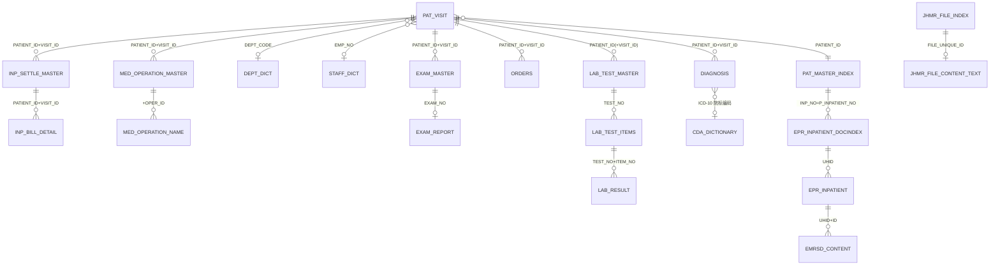

# 数据资产：表结构与关联关系（合并权威版）

> 合并自两份《已确认》梳理文档，并经 `08_数据中心元数据快照.json` 活元数据校验。
> 校验结论：33 张核心已确认表中 **32 张在数据中心 8.216 验证通过**；唯一缺失 `HIS.DOC_REGISTER_EMP_MATCH`（仅在 HIS 生产库）。
> 机器可读资产包见 `数据资产_资产包/`（tables.csv / columns.csv / relationships.csv / catalog.json）。

## 置信度与分层

| 级别 | 含义 |
|---|---|
| **A** | 字段与关联均在实跑 SQL 中确认 |
| **B** | 字段已确认，关联需补充验证 |
| **C** | 仅业务推测，不进入正式关系 |

| 分层 | 范围 | 校验状态 |
|---|---|---|
| **Tier 1 数据中心内** | HIS / MTL / JHEMR / SM / CDA / YDHL / PORTAL_EMPI | ✅ 已用 8.216 活元数据校验（行数/列数见各表） |
| **Tier 2 外部系统** | BIS 输血 / Pitaya 病理 / JZCIS 体检 / HRP 人事 / 血透(PG) | ⚠️ 未联网，沿用历史已确认内容，未校验 |

## 0. 主线总览

住院一切以 **`HIS.PAT_VISIT` (PATIENT_ID + VISIT_ID)** 为核心挂载：

```text
HIS.PAT_VISIT (PATIENT_ID + VISIT_ID)        ← 住院就诊事实主表
  ├─ HIS.PAT_MASTER_INDEX  (PATIENT_ID)       患者主索引
  ├─ HIS.DIAGNOSIS         (PATIENT_ID+VISIT_ID)   → CDA.CDA_DICTIONARY(ICD-10)
  ├─ HIS.ORDERS            (PATIENT_ID+VISIT_ID)   医嘱
  ├─ SM.MED_OPERATION_MASTER → SM.MED_OPERATION_NAME  手术
  ├─ HIS.EXAM_MASTER → HIS.EXAM_REPORT (EXAM_NO)      检查
  ├─ HIS.LAB_TEST_MASTER → LAB_RESULT (TEST_NO)       检验
  ├─ HIS.INP_SETTLE_MASTER → INP_BILL_DETAIL          住院费用
  └─ MTL.EPR_INPATIENT_DOCINDEX (INP_NO=P_INPATIENT_NO) → EPR_INPATIENT → EMRSD_CONTENT  旧EMR文书
```

万能主键：住院 `PATIENT_ID + VISIT_ID`；患者 `PATIENT_ID`；住院号 `PAT_MASTER_INDEX.INP_NO`；检验 `TEST_NO`；检查 `EXAM_NO`；手术 `PATIENT_ID + VISIT_ID + OPER_ID`。

---

## 1. 就诊与患者主数据

### 1.1 `HIS.PAT_VISIT` 住院就诊主表 〔A〕
- **行数(统计)**：575,041　**列数**：268　**粒度**：一名患者一次住院　**主键**：`PATIENT_ID + VISIT_ID`
- 关键字段：`DEPT_ADMISSION_TO`(入院科室) / `DEPT_DISCHARGE_FROM`(出院科室) / `ADMISSION_DATE_TIME` / `DISCHARGE_DATE_TIME`(上报范围常用) / `DOCTOR_IN_CHARGE`(主管) / `ATTENDING_DOCTOR`(主治) / `DISCHARGE_WARD_CODE` / `DISCHARGE_BED_NO` / `INSURANCE_NO` / `INSURANCE_TYPE` / `CHARGE_TYPE`。
- **确认关联**：
```sql
PAT_VISIT pv
 LEFT JOIN PAT_MASTER_INDEX pm ON pm.PATIENT_ID = pv.PATIENT_ID
 LEFT JOIN DEPT_DICT ad        ON ad.DEPT_CODE  = pv.DEPT_ADMISSION_TO
 LEFT JOIN DEPT_DICT dd        ON dd.DEPT_CODE  = pv.DEPT_DISCHARGE_FROM
 LEFT JOIN STAFF_DICT sd       ON sd.EMP_NO     = pv.DOCTOR_IN_CHARGE
```

### 1.2 `HIS.PAT_MASTER_INDEX` 患者主索引 〔A〕
- **行数**：1,939,319　**列数**：113　**主键**：`PATIENT_ID`
- 关键字段：`INP_NO`(住院号) / `NAME` / `SEX` / `DATE_OF_BIRTH` / `ID_NO` / `ID_TYPE`(经CDA映射) / `PHONE_NUMBER_HOME/BUSINESS` / `MAILING_ADDRESS` / `NEXT_OF_KIN(_PHONE/_ADDR)`。
- 关联：经 `INP_NO = EPR_INPATIENT_DOCINDEX.P_INPATIENT_NO` 进旧 EMR 文书。

### 1.3 `HIS.DEPT_DICT` 科室字典 〔A〕
- **行数**：815　**列数**：46　**主键**：`DEPT_CODE`
- 字段：`DEPT_CODE/DEPT_NAME`（院内）；`QMPT_CODE/QMPT_NAME`（平台标准，如有）。
- 关联：门诊/入院/出院/开单/执行/报告等所有科室字段的标准化来源。

### 1.4 `HIS.STAFF_DICT` 人员字典 〔A〕
- **行数**：4,216　**列数**：30　**主键**：`EMP_NO`
- 字段：`EMP_NO` / `NAME` / `ID_NO`。关联：`PAT_VISIT.DOCTOR_IN_CHARGE/ATTENDING_DOCTOR`、医嘱医生字段。

### 1.5 `HIS.DOC_REGISTER_EMP_MATCH` 医师执业注册匹配 〔A〕⚠️不在数据中心
- **校验缺失**：8.216 未发现此表（仅在 HIS 生产库）。字段：`EMP_NO` / `PRACTICE_CERT_CODE`（执业证书号）。
- 用途：取 `DIAG_DOC_CERTIFICATE_NO` 等；关联 `EMP_NO = PAT_VISIT.DOCTOR_IN_CHARGE/ATTENDING_DOCTOR`。接入生产库后再校验。

### 1.6 `HIS.PATS_IN_HOSPITAL` 在院/床位兜底 〔A〕
- **行数**：1,250　**列数**：34　**主键**：`PATIENT_ID + VISIT_ID`
- 当 `PAT_VISIT.DISCHARGE_WARD_CODE/DISCHARGE_BED_NO` 为空时，作为病区/床号兜底。

### 1.7 `PORTAL_EMPI.PATIENT_INFO` 跨系统患者主索引 〔B〕
- **行数**：1,684,177　**列数**：63
- EMPI 系统含 `PATIENT_INFO / PATIENT_INFO_EQUAL / PATIENT_INFO_IRREGULARITY / PATIENT_INFO_SIMILARITY / PATIENT_MATCH_RULE(_DETAIL)`。跨系统患者 ID 关联方案（见 §开放问题），关联键待确认。

---

## 2. 诊断域

### 2.1 `HIS.DIAGNOSIS` 诊断明细 〔A〕
- **行数**：3,324,186　**列数**：23　**粒度**：一次住院×一条诊断　**键**：`PATIENT_ID + VISIT_ID (+ DIAGNOSIS_TYPE + DIAGNOSIS_NO)`
- 字段：`DIAGNOSIS_TYPE` / `DIAGNOSIS_NO`(主诊断常=1) / `DIAGNOSIS_CODE`(院内ICD) / `DIAGNOSIS_DESC` / `DIAGNOSIS_CODE2/DESC_DOC`(病案首页/病理场景) / `DIAGNOSIS_DATE` / `TREAT_RESULT` / `ADMISSION_CONDITION` / `DOCTOR_CODE`。
- **DIAGNOSIS_TYPE 口径**：`2`=入院/初诊　`3`=出院　`8`=病理　`7`=损伤/中毒　`1`=门急诊。
- 关联：`DIAGNOSIS.PATIENT_ID=PAT_VISIT.PATIENT_ID AND DIAGNOSIS.VISIT_ID=PAT_VISIT.VISIT_ID`。

### 2.2 `HIS.DIAGNOSIS_TYPE_DICT` 诊断类型字典 〔A〕
- **行数**：12　**列数**：6　**主键**：`DIAGNOSIS_TYPE_CODE`　关联 `DIAGNOSIS.DIAGNOSIS_TYPE`。

### 2.3 ICD-10 标准化（经 `CDA.CDA_DICTIONARY`）〔A〕
- `CDA.CDA_DICTIONARY` 行数 79,031 / 列数 7。字段：`字典名称 / 系统标识 / 院标编码 / 院标名称 / 国标编码 / 国标名称`。
```text
条件: 字典名称='ICD-10诊断编码' AND 系统标识='HIS' AND 院标编码 = DIAGNOSIS.DIAGNOSIS_CODE
取: 国标编码 / 国标名称(为空回退 HIS 原始 CODE/DESC)
⚠ 关联前按 院标编码 聚合，避免一对多放大记录数
```

---

## 3. 手术域（SM 手麻）

### 3.1 `SM.MED_OPERATION_MASTER` 手术主记录 〔A〕
- **行数**：138,005　**列数**：147　**业务键**：`PATIENT_ID + VISIT_ID + OPER_ID`
- 字段：`OPERATING_DEPT` / `START_DATE_TIME` / `END_DATE_TIME` / `SURGEON`(主刀) / `FIRST/SECOND_ASSISTANT` / `ANESTHESIA_METHOD/DOCTOR` / `OPERATION_SCALE` / `DIAG_BEFORE/AFTER_OPERATION` / `BLOOD_LOSSED/TRANSFERED`。

### 3.2 `SM.MED_OPERATION_NAME` 手术操作明细 〔A〕
- **行数**：141,167　**列数**：13　**键**：`PATIENT_ID + VISIT_ID + OPER_ID (+ OPERATION_NO)`
- 字段：`OPERATION`(名称) / `OPERATION_CODE` / `OPERATION_SCALE` / `WOUND_GRADE`(切口)。
- 关联：`MED_OPERATION_NAME` 于 `PATIENT_ID+VISIT_ID+OPER_ID` 挂 `MED_OPERATION_MASTER`（一对多）。

### 3.3 `HIS.OPERATION`（HIS 侧手术）〔B〕⚠️
- **行数**：527,895　**列数**：31　**`OPER_ID` 全为 NULL，禁止用它关联手麻**。仅按 `PATIENT_ID+VISIT_ID` 取 HIS 侧手术/操作描述。

---

## 4. 检查/影像域

### 4.1 `HIS.EXAM_MASTER` 检查主表 〔A〕
- **行数**：3,385,322　**列数**：58　**主键**：`EXAM_NO`（住院键 `PATIENT_ID+VISIT_ID`）
- 字段：`EXAM_CLASS`(⚠存中文:CT/磁共振/X光/心电图/听力检查,非字典内码) / `REQ_DATE_TIME` / `SCHEDULED_DATE_TIME` / `EXAM_DATE_TIME` / `CLIN_DIAG` / `ORDER_ID`。

### 4.2 `HIS.EXAM_REPORT` 检查报告 〔A〕
- **行数**：1,314,456　**列数**：14　**关联**：`EXAM_NO`（⚠**无 PATIENT_ID**，必经 EXAM_NO 回 EXAM_MASTER）
- 字段：`REPORT_TIME` / `EXAM_DIAG`(结论) / `IMPRESSION`(影像印象,结论多在此) / `DESCRIPTION` / `USE_IMAGE`(图像链接)。

---

## 5. 检验域

### 5.1 `HIS.LAB_TEST_MASTER` 检验报告主表 〔A〕
- **行数**：9,134,900　**列数**：49　**主键**：`TEST_NO`（住院键 `PATIENT_ID`，`VISIT_ID` 为 0/NULL 按门诊）
- 字段：`SPECIMEN`(标本) / `ORDERING_DEPT` / `REQUESTED_DATE_TIME` / `EXECUTE_DATE` / `RESULTS_RPT_DATE_TIME`。

### 5.2 `HIS.LAB_TEST_ITEMS` 检验项目 〔A〕
- **行数**：9,602,577　**列数**：16　**主键**：`TEST_NO + ITEM_NO`（备选 `ORDER_ID+ORDER_ITEM_ID`）
- 字段：`ITEM_NAME/CODE` / `ORDER_ID/ORDER_ITEM_ID` / `URGENT_SIGN`。

### 5.3 `HIS.LAB_RESULT` 检验结果明细 〔A〕⚠️巨表
- **行数**：96,312,418（约1亿）　**列数**：26　**主键**：`TEST_NO + ITEM_NO + PRINT_ORDER`
- ⚠ **查询必须用 `TEST_NO` 子查询限定，禁止全表扫描**。字段：`REPORT_ITEM_NAME/CODE` / `RESULT` / `UNITS` / `RESULT_RANGE` / `ABNORMAL_INDICATOR` / `RESULT_DATE_TIME`。
- 关联链：`LAB_TEST_MASTER.TEST_NO → LAB_TEST_ITEMS(TEST_NO+ITEM_NO) → LAB_RESULT(TEST_NO+ITEM_NO+PRINT_ORDER)`。

### 5.4 `HIS.LIS_EXAMINE_ITEM_MAP` 检验项目平台值域映射 〔B〕
- **行数**：4,698　**列数**：10。用于 `EMR_INSPECTION_ITEM` 检验项目标准化。

---

## 6. 电子病历文书域

### 6.1 旧系统 `MTL`（出院记录等文书）〔A〕
- `EPR_INPATIENT_DOCINDEX`(行239,860/列36)：`UHID`(文书唯一) / `P_INPATIENT_NO`(=INP_NO) / `P_INPATIENT_TIMES`(=VISIT_ID)。
- `EPR_INPATIENT`(行3,948,751/列49)：`UHID` / `ID` / `DOC_TYPE_NAME`(like '%出院记录%') / `DOC_CREATE_DATE` / `MODIFIEDON`。
- `EMRSD_CONTENT`(行3,946,778/列5)：`UHID` / `段落编号`(=EPR_INPATIENT.ID) / `段落内容`(CLOB)。
```text
PAT_MASTER_INDEX.INP_NO = EPR_INPATIENT_DOCINDEX.P_INPATIENT_NO (+ VISIT_ID=P_INPATIENT_TIMES)
EPR_INPATIENT_DOCINDEX.UHID = EPR_INPATIENT.UHID = EMRSD_CONTENT.UHID
EPR_INPATIENT.ID = EMRSD_CONTENT.段落编号
```

### 6.2 新系统 `JHEMR` 〔A / 患者关联待确认〕
- `JHMR_FILE_INDEX`(行1,119,370/列67)：`FILE_UNIQUE_ID` / `DEPT_CODE` / `TOPIC` / `CAPTION/CREATE/LAST_MODIFY_DATE_TIME` / `CREATOR_NAME` / `FILE_FLAG`(有效 <> 'T')。
- `JHMR_FILE_CONTENT_TEXT`(行1,141,816/列2)：`FILE_UNIQUE_ID` / `MR_CONTENT`(正文)。两者按 `FILE_UNIQUE_ID` 一一关联；`DEPT_CODE → DEPT_DICT`。
- ⚠ **JHEMR 文书与 `PAT_VISIT(PATIENT_ID+VISIT_ID)` 的精确关联键尚未确认**（见 §开放问题）。

---

## 7. 费用与医嘱域

### 7.1 住院费用 〔A〕
- `INP_SETTLE_MASTER`(行622,182/列20)：住院结算主表，键 `PATIENT_ID+VISIT_ID`。
- `INP_BILL_DETAIL`(行 **215,721,688**/列74)：住院费用明细，⚠巨表查询必限定。

### 7.2 门诊主线 〔B〕
- `CLINIC_MASTER`(行5,642,875/列94，键 `PATIENT_ID+VISIT_DATE+VISIT_NO`) → `OUTP_MR`(门诊病历) / `OUTP_RCPT_MASTER`(收据,RCPT_NO) → `OUTP_BILL_ITEMS`(明细,RCPT_NO+ITEM_NO)。

### 7.3 `HIS.ORDERS` 住院医嘱 〔B〕
- **行数**：41,033,865　**列数**：88　**键**：`PATIENT_ID+VISIT_ID(+ORDER_NO)`
- 状态：`1`新开/`2`执行/`3`停止=有效，`4`作废=无效。频次换算：日`counter/interval`、时`*24`、周`/7`、月`/30`。

---

## 8. 护理域 `YDHL`（移动护理）〔B〕
- `MCS_ASSESS_FORM`(行2,382,672/列18)：`PATIENT_UID` / `GENERATOR_TYPE='manul'` / `IS_VALID='1'`。
- `INPATIENTS`(行276,069/列134)：`PAT_INDEX_NO`(=MCS_ASSESS_FORM.PATIENT_UID) / `ADMISSION_WARD_TIME`(非空=有效住院)。
```text
MCS_ASSESS_FORM.PATIENT_UID = INPATIENTS.PAT_INDEX_NO
```

---

## 9. 外部系统（Tier 2，未联网，未校验）

> 以下沿用历史已确认内容，待对应库接入后用活元数据复核。

| 系统/库 | 核心表 | 要点 |
|---|---|---|
| 输血 `BIS` | `B_T_XYXXB`/`B_T_REQD`/`B_T_TRANSFUSIONPROMAN`/`B_T_REACTIONS`/`B_T_POSTTRANSEVAL` | `BAGS_NO=XYXXM\|\|CPM`(COLC IS NOT NULL 去重，禁截断10字节)；`B_T_REACTIONS` 按 PK_NO 先聚合防爆行 |
| 病理 Pitaya(SQLServer) | 报告源表 | `PathologyID`/`PatientID`/`InPatientID`/`VISIT_ID`/`PatientSource`/送检/审核时间；住院唯一按 `PatientID+REAL_VISIT_ID`(去住院号前缀尾位) |
| 体检 `JZCIS`(SQLServer) | `HYB`/`JCMXX`/`DJB`/`JCSFXMTOSFXM`/`V_KSJL` | 主键 `StudyID`；项目主键由 `ID+SFXMDM+XXID` 拼接；类别用 DMD-54 |
| 人事 `HRPSEY656`(SQLServer) | `bd_psndoc`/`hi_psnjob`/`org_dept`/`MD_ENUMVALUE`/`bd_defdoc`/`hi_psndoc_edu`/`hi_psndoc_glbdef2` | 主任职 `ISMAINJOB='Y' ENDFLAG='N' POSTSTAT='Y' LASTFLAG='Y'`；最高学历 `GLBDEF6='Y'` |
| 血透(PostgreSQL) | `Treatment_BeforeSigns` 等 | 透前体重 `bs."Weight"`；干体重优先处方 `pp."DryWeight"` 兜底患者 `p."PredictWeight"` |

---

## 10. 核心关系图



---

## 11. 开放问题（影响关系完整性）

1. **JHEMR 文书 ↔ PAT_VISIT 关联键**：新 EMR 如何精确挂到 `PATIENT_ID+VISIT_ID`（当前仅确认内部 `FILE_UNIQUE_ID` + `DEPT_CODE`）。
2. **PORTAL_EMPI 跨系统患者映射**：`PATIENT_INFO_EQUAL/SIMILARITY` 如何把各系统患者 ID 统一，需确认匹配规则表。
3. **`DOC_REGISTER_EMP_MATCH`**：接入 HIS 生产库后补校验（执业证书号来源）。
4. **手麻 `OPER_ID` 与 HIS**：已确认 HIS 侧 `OPER_ID` 全 NULL；手麻内部 `OPER_ID` 是其自身主键，不可与 HIS 直接相等关联。
5. **LIS 历史库与当前库 UNION**：表名一致但字段/时间范围差异，需逐表确认。

---

## 12. 资产包与导入说明

`数据资产_资产包/`（UTF-8-BOM，Excel 直开；可复跑 `python tools/build_asset_package.py` 重建）：

| 文件 | 内容 | 导入用途 |
|---|---|---|
| `tables.csv` | 全量 865 表：schema/表名/注释/行数/列数 + 已确认 domain/grain/pk/置信度 | 数据目录·表登记 |
| `columns.csv` | 全量 26894 字段数据字典：schema/表/列序/列名/类型/长度/可空/注释 | 数据目录·字段登记 |
| `relationships.csv` | 已确认关联：起止表/列/join条件/基数/置信度/域 + 数据库实测验证等级与指标 | 血缘·关系图 |
| `catalog.json` | 已确认表+关系（结构化，含验证等级，程序读取） | API/图谱后端 |

**导入建议**：选定资产系统后，按其模板做字段映射即可。常见映射：`tables.csv`→`catalog_table`，`columns.csv`→`catalog_column`，`relationships.csv`→`table_relationship`(from/to/columns)。若资产系统支持 JSON，直接用 `catalog.json`。

> 完整字段清单以 `columns.csv` 为准（本 MD 仅列已确认关键字段）。
