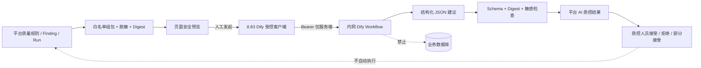

> 类别：待办
>
> 状态：待用户复核；本轮仅完成盘点、归档和计划，尚未授权按本计划开发/发布
>
> 制定日期：2026-08-13（目录与生产基线核查始于 2026-08-12）
>
> 上位入口：`55_系统未完成事项统一执行计划.md` + `README.md`
>
> 适用范围：`backend/`、`frontend/`、`deploy/`、平台 PostgreSQL、8.83 应用发布、内网 Dify AI 质控、查询/指标资产、关系图谱、当前治理初始化与文档收口

# 系统完成度盘点与一次性开发升级执行计划

## 0. 计划定位与授权解释

本文是 2026-08-13 目录清理后的**唯一当前一体化执行子计划**。用户复核后如明确回复“按 130 执行”，执行 AI 应连续完成本计划中标为“纳入一次性执行”的开发、隔离测试、生产应用升级、平台库受控变更和上线验收，不在普通内部检查点停下来反复请求确认。

一次确认仍不扩大下列安全边界：

1. HIS、ODS、HRP、CDMS、JHEMR、LIS、PACS、Docare、移动护理等业务源/目标库，除已经运行且本轮不改变的既有人员夜间链路外，仍只允许 `SELECT`；本计划不授权新增业务库 DML/DDL、GRANT/REVOKE、建视图或批量补写。
2. 不自动开启新的查询调度、质量调度、字典下发、运维写开关或身份同步开关；现有 host cron 不得被关闭、复制或改为双调度。
3. 不执行操作系统、内核、PostgreSQL/Oracle 大版本升级。“服务器升级”仅指本仓库应用镜像、前端发布物、必要的现有 Alembic 迁移和受控平台元数据初始化。
4. 不把负责人、业务术语、指标 SQL、关系或审批结果凭空补齐。缺权威业务口径时保留 `blocked/draft/empty` 并显示原因。
5. 禁止 force-push、移动旧 tag、覆盖用户文件、输出凭据或患者/人员敏感明细。
6. Dify 只作为内网分析执行器：不得直连任何业务数据库，不得获得数据库凭据，不得自动修改质量问题状态、启停规则、执行建议 SQL 或调用业务写接口。平台只推送通过白名单序列化和脱敏检查的质量摘要，Dify 输出始终按“不可信建议草稿”处理。
7. Dify API Key 只能存放在 8.83 服务器受控凭据文件或密钥环境引用中，禁止进入浏览器、平台数据库、代码、Git、日志、审计 request 或本文；本轮不新增自动推送定时任务，首版仅支持用户在质控页面手动选择并推送。

如果用户希望把字典下发到 HIS/JHEMR、对业务目标库新增人员写入、修改 DBA 权限或启用新的生产调度纳入同一窗口，必须在复核回复中逐项明示；否则这些事项只完成代码、只读预检和关闭态验收。

## 1. 2026-08-12 目录与生产基线

### 1.1 目录基线

- 归档前 `开发起步包/` 顶层有 132 个文件、16 个目录，最大文档编号为 129；迁入 28 份历史文档并新增本计划后，顶层为 105 个文件、16 个目录，最大编号为 130。
- 实际文件按编号均能在 README 找到分组或配套编号；未发现真实幽灵文件。未逐文件写名的 JSON 是同号报告的配套结果，不是孤儿。
- 当前根目录积累了多轮平行执行计划和故障交接。58/59/65/66/85、97–105（不含 106）、107–111、113/114、116–121、123 已被后续成果、122/124/125、127/129 和本文替代，迁入 `_archive/`，只迁不删。
- 保留在根目录的当前模块资料：96、106、112、115、122、124、125、126、127、128、129、130；44 作为延后选型参考保留。

### 1.2 Git 与本地工作区

- 分支：`master`。
- 本地 HEAD：`e87ed2e`；相对 `origin/master` 超前 3 个提交、落后 0 个提交。
- 工作区仍包含 129 图谱本地改动和本轮文档改动；禁止 reset/checkout 覆盖。
- 126/127 代码虽已在生产热补丁/镜像中运行，但远端 Git 尚未包含本地 3 个提交；129 最新图谱仍未形成可发布提交。

### 1.3 8.83 生产只读实测

| 项 | 2026-08-12 实测 |
|---|---|
| 后端容器 | `data-asset:126p5-20260811223311`，running/healthy |
| `/api/v1/health` | 200，数据库 connected |
| 平台 Alembic | `h5c6d7e8f9a0` |
| 前端 current | `/opt/data-asset/frontend-dist/releases/graph-pastel-20260812` |
| 查询/指标/产品 | 27 / 48 / 54 |
| 查询调度 | 27 条，启用 0 条 |
| 表/字段/关系 | 7,766 / 89,730 / 537 |
| 关系配方 | 0 |
| 关系复核 | 3 条，均 draft |
| 表负责人/术语 | 0 / 0 |
| 质量规则/启用 | 185 / 10 |
| 质量问题 | 10,439 |
| AI 会话 | 0 |

代码哈希核对显示：127 的 `quality.py`、`relation_reviews.py`、`ai.py`、`main.py` 和配方导入脚本与本地一致；129 新增的 `_field_overview` 在生产容器中不存在，当前前端发布物也没有“查看字段图谱”。因此生产不是完整本地基线，必须以不可变发布物一次性对齐，不能继续零散 hotpatch。

### 1.4 夜间人员链路

- 2026-08-11、2026-08-12 两个修复后夜窗均 success，无 offset-naive/aware TypeError。
- 2026-08-12：主账号 2/2、签名新增 1/1、职称 planned=0 且 2,090 条幂等跳过；主/签名水位 committed。
- H7 当前真实进度为 2/3，第三夜只读观察是运行证据，不阻塞应用开发和发布。
- `ro_identity_nightly_observe.py` 直接执行会因缺 `PYTHONPATH=/app` 报 `ModuleNotFoundError` 假阴性；加 `PYTHONPATH=/app` 后 Pillow、时区门禁均通过。计划内修复观察入口并补回归测试，不能把该假阴性误判为生产依赖缺失。

### 1.5 隔离测试库

- `data_asset_test` 已到 `h5c6d7e8f9a0`。
- `asset.asset_data_products` owner 为 `postgres`，测试账号 `asset_app` 无 TRUNCATE 权限；现有 autouse 清理会因此 teardown error。
- 测试库残留 37 条关系、9 张表资产，造成部分图谱旧断言受顺序/脏数据影响。
- 该问题只允许在隔离测试库按最小权限修复；禁止用生产库替代测试库。

### 1.6 内网 Dify 对接基线

- `01_平台执行方案.md` 已明确 Dify 的定位：内网 AI 分析执行器，不是主元数据库，也不直接连接业务数据库；输入为脱敏元数据/聚合质量信息，输出为结构化 JSON。
- `17_内网部署环境与服务器信息.md` 记录 Dify 位于 `10.10.8.53`、历史版本为 1.13.2；版本信息须在执行阶段通过受控接口再次确认，不能只依赖历史文档。
- 2026-08-13 从 8.83 服务器做无凭据只读连通检查：`http://10.10.8.53/` 返回 307，`/v1/parameters` 返回 401。结论是网络和 Dify Service API 入口可达，401 属于未携带 API Key 的预期拒绝；本次没有使用 Key，也没有发送质量数据。
- 当前仓库已有 `/api/v1/ai/tools`、MCP 风格目录、AI 会话/工具审计、质量规则/运行/问题/指标和“AI 接入与协作”页面，但没有 Dify 出站客户端、质控任务/结果模型、结构化结果校验、专用权限或 AI 质控页面。
- Dify 官方 Workflow API 使用 `POST /workflows/run`，请求包含 `inputs`、`response_mode` 和稳定的 `user`，API Key 通过服务器端 `Authorization: Bearer ...` 提供；blocking 响应包含 `workflow_run_id`、状态和 outputs。Key 不得下发到客户端。官方接口说明：<https://docs.dify.ai/en/api-reference/workflow-runs/run-workflow>。

## 2. 完成度结论

### 2.1 已完成并可直接复用

| 领域 | 完成结论 | 当前证据 |
|---|---|---|
| 数据中心/HIS/周边探库 | 元数据、表字段、关系验证与机器资产包已完成 | 08–25、37–40、52/53、77–86、各资产包 |
| 系统目录与资产治理底座 | 十系统、真实连接、五层资源树、空表治理、中文名已上线 | 89、92、94/95 |
| 登录/RBAC/发布基础 | 登录、JWT、ApiKey、权限资源、离线包与断网演练已完成 | 61–71、127；历史过程已归档 |
| 查询与指标最小闭环 | P1–P5 已生产，27 查询、48 指标、54 产品 | 126、128 |
| 质量/总览/复核/配方代码 | 127 S0–S9 代码和测试门禁完成，主要后端代码已在服务器 | 127 与生产哈希核对 |
| 人员夜间链路 | host cron 唯一，主账号/签名/职称连续两夜成功 | 122、124、125 与本次只读观察 |
| 图谱旧故障修复 | 空图、崩溃、自环/重复边、基本知识图谱布局已有成果 | 129 中的历史生产记录 |

### 2.2 纳入下一次一次性执行

| 编号 | 未完成项 | 当前差距 | 完成判定 |
|---|---|---|---|
| U01 | 工作区和发布基线收口 | HEAD 超前 origin 3 提交，129 仍 dirty | 差异审计、秘密扫描、逻辑提交；普通 push 后本地/远端一致 |
| U02 | 测试库稳定性 | 新表 TRUNCATE 权限缺失、历史脏数据 | 仅测试库最小权限修复；完整 pytest 连续两次 0 failed |
| U03 | 129 四层关系图谱 | 本地完成，生产缺 field API/字段入口 | 系统→库→表→字段、真实表关系、PK/关系键在生产可用，真实浏览器验收通过 |
| U04 | 127 生产闭环 | 代码已在服务器但发布基线混合；配方/复核/治理数据未初始化 | 不可变镜像发布；批准已证实的 2 条 review 仅链接既有 formal，第 3 条保持 draft；配方幂等导入；质量数据按 dry-run 决定是否重建 |
| U05 | 查询指标补录 | 生产仅 27 active；本地已有 01/02/13/22 等新增 SQL，仍有 17 项无独立 SQL | 现有 SQL 全部经 query gate/只读验证后摄取；无法从权威口径实现的指标保持 blocked 并写明原因，禁止伪造 |
| U06 | 夜间观察与观察脚本 | H7 2/3；直接运行有 PYTHONPATH 假阴性 | 修复脚本入口测试；取得第 3 个自然夜窗 success 后关闭 H7；不重复历史补跑 |
| U07 | 诊断/手术字典关闭态收口 | 96/112/115 代码已开发，真实双目标联调和生产下发未放行 | 完成代码复核、隔离/模拟联调、只读预检、审计与默认关闭验收；本计划默认不写 HIS/JHEMR |
| U08 | 统一生产发布与验收 | 当前后端/前端来源不同，build id 仍是历史 working-tree | 从同一 commit 构建不可变后端/前端，备份、原子切换、健康/API/RBAC/图谱/质量/查询中心/回滚验收全部通过 |
| U09 | 文档和 Git 最终状态 | README/55 有大量过时平行入口 | 130 执行结果回写；完成项再归档；README 与实际目录一致；生成不可变 release tag |
| U10 | 内网 Dify AI 质控工作台 | Dify 网络入口可达，平台有 AI/质量底座，但没有出站适配器、任务结果模型、页面和端到端契约 | 完成手动选题→安全预览→Dify Workflow→JSON Schema 校验→建议复核→全链路审计；Dify 不直连数据库、不接收敏感样本、不自动改变质量事实 |

### 2.3 不得伪装成可自动完成

| 事项 | 原因 | 本轮处理 |
|---|---|---|
| 剩余 17 条无 SQL 指标 | 部分指标可能缺结构化字段或业务口径 | 有证据才实现并 active；否则保留 blocked 和差距说明 |
| 表负责人、业务术语 | 当前没有权威来源 | 页面提供真实空状态；不生成假负责人/术语 |
| 新开查询/质量调度 | 需要逐条运行口径和负载确认 | 保持 27 条查询调度 enabled=0 |
| 字典/业务目标库正式写入 | 涉及 HIS/JHEMR 业务 DML、专用凭据、序列和 DBA 门禁 | 默认只做关闭态开发验收；另行明示授权才执行 |
| 新增 Neo4j 数据库 | 当前需求是 Neo4j 式视觉，不是新建 Neo4j 基础设施 | 不实施；历史 PoC 文档归档 |
| OS/数据库大版本升级 | 超出应用升级范围且风险高 | 不实施 |
| Dify 正式端到端调用（若无 Workflow Key） | API Key 和已发布 Workflow 属于服务器外部受控配置，不能写入计划或 Git | 完成全部代码、DSL/契约、mock/隔离测试和生产关闭态；只有 Key 被安全放入服务器凭据文件后才做真实 E2E，缺失时必须标为 BLOCKED，不能伪造成功 |

### 2.4 内网 Dify AI 质控详细设计

#### 2.4.1 产品定位和首版范围

新增独立页面 `/asset/ai-quality`，名称“AI 质控分析”。它是数据质量模块的分析辅助层，不替代现有 `/asset/quality` 的规则、运行、问题整改和质量事实。

首版支持三类任务：

1. **单问题分析**：从问题清单选择 1 条 finding，分析可能根因、误报可能、处置建议和后续核查项。
2. **选中问题批量分析**：相同系统/规则/表的一组问题，最多 50 条，生成共性根因和优先级建议；跨系统选择必须拆批，避免上下文混杂。
3. **质控批次摘要**：按 `quality_check_run` 发送规则数、问题数、通过率、严重程度和 Top 表等聚合信息，生成面向质控人员的批次报告。

首版不做自动定时推送、不做患者级明细分析、不允许 Dify 回调执行平台工具。若未来启用自动推送，必须另行增加负载评估、静默期、日配额和用户授权，不能从本计划推定。



#### 2.4.2 页面设计

页面分为五个区域：

| 区域 | 展示与操作 | 关键约束 |
|---|---|---|
| 连接状态 | Dify 可用/未配置/故障、Workflow 名称、prompt/schema 版本、最近成功时间、超时与配额状态 | 只显示 Key“已配置/未配置”，永不回显 Key、凭据路径或完整内部错误栈 |
| 待分析问题 | 系统、批次、规则、严重程度、状态、表/字段筛选；单选或同域多选 | 默认只列 open/assigned/acknowledged；最大 50 条；后端重新校验选择范围，不能只信前端 |
| 安全预览 | 实际将发送的字段、条数、字节数、脱敏/丢弃字段统计、input_digest | 提交前必须先 preview；`sample_data`、患者标识、姓名/证件/电话/地址、凭据和任意自由文本 detail 默认不发送 |
| 分析任务 | queued/running/succeeded/failed/unknown/blocked、Dify run id 截断显示、耗时、token、重试资格 | 相同 input_digest + prompt_version 复用已有成功结果；处理中禁止重复点击 |
| 结果与复核 | 摘要、风险等级、根因、建议、误报可能、后续核查；接受/拒绝/部分接受和复核备注 | “接受”只更新 AI 结果的复核状态，并通过既有 job-finding 关联供问题页查看；不改 finding 字段、规则 enabled 或执行 SQL |

在现有数据质量“问题整改”表增加“AI 分析”快捷按钮，跳转到该页面并携带 finding id；独立页面仍是唯一完整工作台。页面需明确显示“AI 建议，仅供质控复核”。

#### 2.4.3 平台发送给 Dify 的固定输入契约

Workflow 输入变量固定为：

| 变量 | 类型 | 内容 |
|---|---|---|
| `schema_version` | string | 固定 `quality-analysis-input/v1` |
| `request_id` | string | 平台生成的不可变任务号，不含人员工号 |
| `task_type` | string | `finding` / `finding_batch` / `run_summary` |
| `prompt_version` | string | 例如 `quality-control-v1`，参与幂等键 |
| `payload_json` | string | 经过 canonical JSON、大小限制和敏感字段扫描的质控摘要 |
| `input_digest` | string | canonical payload 的 SHA-256，用于回显核对 |

`payload_json` 只允许以下白名单内容：finding id、run id、规则编码/中文名/分类、系统/数据源/Owner、表/字段、严重程度、当前状态、聚合 total/error/error_rate、元数据类型/可空/主键标志、已确认关系摘要、历史同规则数量和安全检查结果。允许包含已经通过 `validate_sql_safety` 的规则 SELECT，但默认仅发送 SQL 摘要/hash；用户明确勾选“包含安全规则 SQL”且具有分析权限时才发送完整只读 SQL。

明确禁止：`sample_data`、患者/人员行级值、姓名、身份证、电话、地址、住院号、门诊号、病历号、签名图片、自由文本病历、数据库连接串、credential_ref、Token、Cookie、API Key、源库错误栈和未经白名单筛选的 `detail` JSON。

#### 2.4.4 Dify 返回结果契约

Dify Workflow 的 Output 节点必须返回可解析对象（或 `result` 中的 JSON 字符串），平台转换后按 `quality-analysis-output/v1` 校验：

```json
{
  "schema_version": "quality-analysis-output/v1",
  "request_id": "AQJ-...",
  "input_digest": "sha256...",
  "summary": "问题概述",
  "risk_level": "critical|high|medium|low|unknown",
  "root_causes": [
    {"title": "可能根因", "reason": "证据说明", "confidence": 0.82, "evidence_finding_ids": [1]}
  ],
  "recommendations": [
    {
      "title": "建议动作",
      "action_type": "rule_adjustment|data_remediation|metadata_fix|manual_review|monitor",
      "priority": "P0|P1|P2|P3",
      "reason": "为什么",
      "confidence": 0.75,
      "target_refs": ["OWNER.TABLE.COLUMN"]
    }
  ],
  "false_positive": {"possible": true, "reason": "规则口径可能不适用"},
  "follow_up_checks": [
    {"description": "只读复核建议", "sql_draft": null}
  ],
  "limitations": ["未包含患者级样本"]
}
```

校验要求：`request_id` 和 `input_digest` 必须与请求一致；枚举、长度、数组上限和 confidence 0–1 均严格限制；输出中的 HTML/Markdown 按纯文本安全渲染；SQL 草稿只能进入 AI 草稿/查询门禁，永不自动执行；JSON 不合法、摘要为空、digest 不一致、输出超限或出现疑似凭据/敏感数据时，结果进入 `blocked`/隔离摘要，不写入正式建议。

#### 2.4.5 后端和平台表设计

在 `asset` schema 手写 Alembic 迁移，新增：

| 表 | 关键字段 | 用途 |
|---|---|---|
| `asset_ai_quality_jobs` | `job_key` unique、task_type、prompt/schema version、input_digest、input_summary、status、requested_by、Dify run id、attempt、耗时/token、error_class/summary、时间戳 | 持久化任务状态、幂等与可观测性；不保存 Key和行级样本 |
| `asset_ai_quality_job_findings` | job_id + finding_id 联合唯一 | 固化任务与问题的证据链接，避免后续筛选漂移 |
| `asset_ai_quality_results` | job_id unique、risk_level、summary、structured_result、output_digest、review_status/by/at/note、accepted_recommendations、attached_by/at | 只保存通过 JSON Schema 和敏感检查的结构化建议及人工复核/挂接状态；通过 job-finding 关系展示，不覆盖 finding 原字段 |

`downgrade()` 只删除本次三张表和索引；迁移禁止 autogenerate。所有任务创建、调用完成、失败、重试、结果复核和结果挂接动作同时写 `GovernAuditLog`，审计只记录摘要、digest、计数和错误类别。

后端新增独立适配器，建议文件范围：

- `backend/app/services/dify_quality_client.py`：URL/主机白名单、Bearer Key 读取、timeout、请求/错误分类和响应大小限制；禁止跟随到非白名单主机。
- `backend/app/services/ai_quality_payload.py`：按白名单组装 canonical payload、敏感扫描、字节/条数限制和 digest。
- `backend/app/services/ai_quality_result.py`：Dify outputs 提取、JSON Schema/Pydantic 校验、digest 回显和安全渲染。
- `backend/app/api/v1/ai_quality.py`：挂载 `/api/v1/quality/ai/*`，复用 quality 模块角色保护并叠加细粒度权限。

API 契约：

| 方法 | 路径 | 用途/权限 |
|---|---|---|
| GET | `/api/v1/quality/ai/status` | 配置、可达性和统计摘要；`asset.quality.ai.view` |
| POST | `/api/v1/quality/ai/connection-test` | 受控调用 Dify app 参数/信息接口；`asset.quality.ai.connection_test` |
| POST | `/api/v1/quality/ai/preview` | 返回安全 payload、digest、字节数和剔除项；`asset.quality.ai.analyze` |
| POST | `/api/v1/quality/ai/jobs` | 创建并调用发布的 Workflow；`asset.quality.ai.analyze` |
| GET | `/api/v1/quality/ai/jobs` | 分页筛选任务；`asset.quality.ai.view` |
| GET | `/api/v1/quality/ai/jobs/{id}` | 任务、输入摘要、结果和审计时间线；`asset.quality.ai.view` |
| POST | `/api/v1/quality/ai/jobs/{id}/retry` | 仅可重试明确 retryable 的失败；`asset.quality.ai.analyze` |
| PATCH | `/api/v1/quality/ai/results/{id}/review` | 接受/拒绝/部分接受；`asset.quality.ai.review` |
| POST | `/api/v1/quality/ai/results/{id}/attach` | 标记已复核结果可通过现有 job-finding 关系在问题页展示，不修改 finding 记录；`asset.quality.ai.review` |

#### 2.4.6 权限、配置与凭据

新增资源权限：

- `asset.quality.ai.view`：浏览页面、任务和安全结果；
- `asset.quality.ai.analyze`：预览并发起/重试分析；
- `asset.quality.ai.review`：复核与关联建议；
- `asset.quality.ai.connection_test`：仅平台管理员执行连接测试。

`quality_admin` 默认获得 view/analyze/review；`platform_admin` 通过全资源获得全部权限；普通资产查看员、`ai_user` 和匿名用户不自动获得质控数据权限。前端 `v-perms` 只负责体验，后端必须逐接口强制校验。

生产配置仅保存非秘密参数：

```text
APP_DIFY_QUALITY_ENABLED=false
APP_DIFY_BASE_URL=http://10.10.8.53/v1
APP_DIFY_ALLOWED_HOSTS=10.10.8.53
APP_DIFY_QUALITY_API_KEY_REF=file:///etc/data-asset/credentials/dify_quality_workflow.api_key
APP_DIFY_QUALITY_WORKFLOW_NAME=data-quality-control
APP_DIFY_QUALITY_PROMPT_VERSION=quality-control-v1
APP_DIFY_CONNECT_TIMEOUT_SECONDS=3
APP_DIFY_READ_TIMEOUT_SECONDS=90
APP_DIFY_MAX_FINDINGS_PER_JOB=50
APP_DIFY_MAX_PAYLOAD_BYTES=65536
APP_DIFY_TLS_VERIFY=true
APP_DIFY_CA_BUNDLE=
```

API Key 文件权限必须为宿主机 root/服务账号可读的 600，容器只读挂载。若后续改 HTTPS 且使用医院 CA，应配置 CA bundle，禁止在生产简单关闭证书校验。

#### 2.4.7 幂等、故障和 Dify Workflow 交付

- `job_key = sha256(tenant + task_type + sorted(finding_ids/run_id) + input_digest + prompt_version)`；成功任务重复提交直接复用，running/queued 返回原任务，失败重试保留原 job 链路。
- 首版使用 Dify blocking 模式，平台先提交 planned job 再出站调用；服务重启时遗留 running 标为 `unknown`，不得自动重复发送。
- 仅连接拒绝、429 `too_many_requests` 和可确认未提交的网络错误可有限退避重试；401/403、参数错误、模型未配置/配额、输出契约错误不重试。read timeout 或 5xx 若无法确认 Dify 是否已运行，标记 unknown/failed 并由用户用同一 digest 手工复核后重试。错误分类遵循 Dify 官方说明：<https://docs.dify.ai/en/api-reference/guides/errors>。
- 每次调用使用稳定但匿名的 Dify `user`：由平台用户主键经 HMAC/不可逆摘要生成，不发送登录名、姓名或工号；同一用户后续查询保持一致。
- 在 `deploy/dify/` 提供 Workflow 输入/输出 Schema、固定 system prompt、示例 payload、导入/发布说明和脱敏测试样例；如 Dify 版本支持稳定 DSL 导出，再保存无 Key 的 DSL。Workflow 只含输入校验→质控分析→JSON 规范化→Output，不配置数据库工具、HTTP 回调写入或平台写工具。
- 真正 E2E 前先用合成 finding 验证，再用 1 条无样本生产质量摘要验证；通过后才允许最多 10 条的小批次，最后开放 50 条上限。

## 3. 一次性执行顺序

> 用户批准后按 `S0 → S1 → … → S11` 连续执行。内部 PASS 直接进入下一步；普通缺陷就地修复并重测，不以“需要确认”为由停顿。只有备份失败、生产/测试环境身份不明、远端 Git 分叉、业务源写入权限扩大、不可逆数据冲突或用户提供的新指令才停止。Dify Key/Workflow 尚未安全配置时不阻断其余应用发布，但 Dify 真实 E2E 必须如实标记 BLOCKED。

### S0：重新建立只读基线和精确发布清单

1. 重读 AGENTS、README、55、40、96、112、115、122、124–130。
2. 执行目录自检、`git status`、`git diff --check`、分支/远端/tag 对账。
3. 只读核对 8.83 容器镜像、健康、Alembic、current 软链接、调度 provider、水位和平台计数。
4. 生成本轮允许修改、发布、平台 apply 和明确禁止的清单。
5. 对当前 dirty 文件逐个归属，不覆盖用户或其他协作者改动。

验收：基线证据含时间、commit、镜像、数据库 head、前端 release、计数和回滚点；敏感值不输出。

### S1：修复隔离测试库和当前回归测试

1. 对 `data_asset_test` 先做备份。
2. 将 `asset_data_products` 及后续迁移表的 owner/序列权限统一到测试账号，或授予测试清理所需的最小 TRUNCATE 权限；不改生产权限。
3. 清理测试库脏数据并重新执行最小种子，确保每个测试前后确定性一致。
4. 修订仅依赖历史脏数据的图谱断言，使其验证接口契约而不是测试顺序。
5. 运行 `tests/test_graph.py`，再运行完整 `tests/ -q`；完整套件连续执行两次。

验收：两次完整 pytest 均 0 failed/0 error；测试库 head 正确；生产平台库写入 0。

### S2：完成并加固四层关系图谱

1. 复核并保留 129 当前本地改动：字段节点契约、字段层下钻、渐进式面包屑、G6/SVG 双引擎、白底柔色和中心节点。
2. 后端对象层只查询当前显示节点可能涉及的关系，避免遍历全部关系；物理键和 namespace 兼容反查必须唯一，多义不猜。
3. 字段层限制最多 80 个节点并提示截断；主键和关系键来自当前表资产及正式关系端点。
4. 表层仅显示真实表间关系；系统/数据连接/Owner 层显示聚合关系并允许继续下钻。
5. 补性能、重复名跨源隔离、无关系表、超字段数、方向、边详情和双渲染引擎测试。
6. 浏览器验收固定覆盖系统→库→表→字段、返回上层、关系方向、表详情和至少三次刷新。

验收：API 契约、节点/边物理身份、1440×900 可读性、console/unhandled/network 非预期错误均通过；不使用 `数据图谱.png`。

### S3：完成 127 治理闭环

1. 复核生产与当前代码哈希，停止继续 hotpatch，统一进入本轮镜像。
2. 对 185 条质量规则和 10,439 条问题先做 dry-run：规则中文名、系统归属、重复/过期问题和重建数量；只有幂等键、回滚 SQL 和批量上限齐全才 apply。
3. Review 1/2 只链接到已存在的 formal 关系，不提升 candidate 537/538、不制造重复 formal；Review 3 保持 draft。
4. 关系配方先 dry-run，再幂等导入完整 `recipe_json`。已验证种子可标 approved，但默认 inactive；是否 active 只按种子状态和本计划批准范围执行。
5. 负责人、术语和 AI 会话保持真实空值；页面用中文空状态说明下一步，不造数据。
6. 运行 127 号计划原定义的 A1–A25，尤其 A8 大表安全、A14–A16 Review、A17–A19 配方、A25 真实生产验收。

验收：数据变化前后数量守恒，重复运行 writes=0；所有平台写入可回滚；源库零写。

### S4：收口 48 项核心制度查询与指标

1. 按 `query-governance-intake` 先检索生产 active 查询和版本，禁止重复建档。
2. 校验本地现有 31 个独立 SQL，识别生产缺少的 01/02/13/22 等新增文件；通过 `queryctl validate`、元数据、关系和大表门禁。
3. 对每个新增/修订 SQL执行限定时间、聚合结果的只读验证；参数变化只形成 run，SQL/口径变化才 revise。
4. 从官方 docx、总 SQL 和历史过程文件分析剩余 17 项；能以现有结构化数据准确实现的，形成参数化 Oracle 11g SELECT；不能实现的保留 blocked，记录缺表、缺字段、模板未结构化或业务定义未确认。
5. 经确定性门禁通过的版本可 active；blocked 不发布数据产品，不启用调度。
6. 更新指标—查询—关系—数据产品血缘和生产计数。

验收：无重复 query_code/version；active SQL 全部只读、可追溯、可复跑；所有 48 项都有 active 或明确 blocked 原因，不能只留空标题。

### S5：实现内网 Dify AI 质控工作台

1. 先固定 `quality-analysis-input/v1`、`quality-analysis-output/v1`、prompt version、敏感字段黑名单、输入白名单、条数/字节/输出长度上限和示例契约。
2. 手写 Alembic 迁移新增三张 `asset_ai_quality_*` 表及唯一键/索引，完成 `upgrade()`/`downgrade()` 和隔离库往返测试。
3. 实现 payload builder：只从当前平台质量规则、finding、run、资产元数据和正式关系读取；`sample_data` 与非白名单 detail 在进入出站客户端之前不可达。
4. 实现 Dify client：将 `httpx` 固定为生产依赖并同步 requirements/锁定文件/Linux 离线 wheelhouse；只允许配置的 http/https scheme 和 host；Key 从 secret ref 读取；Bearer 只在服务端组装；禁止跨主机重定向；限制响应大小、连接/读取超时并按官方错误分类处理。
5. 实现 output validator：兼容 Dify blocking response 的 outputs 对象或 result JSON 字符串；强制 request_id/input_digest 回显、Pydantic/JSON Schema、枚举/长度/敏感扫描和纯文本渲染。
6. 实现 `/api/v1/quality/ai/*` 的 status、connection-test、preview、jobs、retry、result review/attach；所有写动作写 GovernAuditLog，所有权限后端强制。
7. 扩展 `permissions.py`、角色默认权限和防越权测试；确认旧 Token、普通 asset_viewer、ai_user 不因新增菜单自动取得质控权限。
8. 在 `frontend/src/api/asset.ts` 扩展 API，在 `frontend/src/router/modules/asset.ts` 增加 `/asset/ai-quality`，新增工作台页面和质量问题快捷入口；覆盖连接空态、未配置、超时、成功、结构错误、复核和重复提交状态。
9. 在 `deploy/dify/` 交付无秘密的 prompt、输入/输出 Schema、示例、Workflow 搭建/导入/发布指南和回滚说明；Workflow 禁止数据库节点及平台写回节点。
10. 用 mock Dify 覆盖完整契约和错误矩阵；再从 8.83 做真实网络/未授权 401 检查。取得服务器受控 Key 后，按“合成数据→1 条真实摘要→最多 10 条小批次”逐级 E2E，禁止直接推送 10,439 条历史问题。
11. 生产配置初始保持 `APP_DIFY_QUALITY_ENABLED=false`；完成 Key 权限、Workflow 发布、Schema 回显和小批次 E2E 后方可切 true。该开关只开放人工分析，不创建定时推送。

验收：页面/API/RBAC/幂等/脱敏/Schema/审计/失败恢复全绿；浏览器和 API 均看不到 Key；Dify 收到的 payload 不含患者/人员明细；AI 建议不会自动改变 finding、rule 或执行 SQL。缺 Key/Workflow 时关闭态 PASS、真实 E2E BLOCKED，不伪造联通成功。

### S6：夜间链路观察与关闭态安全复核

1. 修复 `ro_identity_nightly_observe.py` 的运行入口，使脚本自身建立 `/app` 模块路径，补直接脚本运行测试。
2. 只读核对第三个修复后夜窗；要求 main/signature/title 子任务真实状态、计数守恒、水位和唯一 provider 正常。
3. 不重复历史签名补跑，不手工触发全量人员 runner，不改变 host cron、nightly env 或现有写权限。
4. 复核脱敏日志和告警；历史 TypeError 可保留追溯，但不得继续触发。

验收：H7 3/3；观察脚本无环境假阴性；如果第三夜自然窗口尚未到达，只把 H7 保留为运行观察，不阻断应用发布，也不得伪造 3/3。

### S7：诊断/手术字典模块开发收口（默认关闭）

1. 按 96/112/115 核对 outbox、worker、同目标事务、sequence 白名单、写后回读、重试/死信、审计脱敏和客户端不可提交 SQL/action。
2. 在隔离库和 mock 目标完成 HIS 成功/JHEMR 失败、JHEMR 成功/HIS 失败、并发、回读失败、幂等和补偿测试。
3. 只读核查目标表/字段/状态值、重复编码和 sequence 配置；无合法 sequence 时明确 failed-closed，禁止 `MAX+1`。
4. 生产写开关、字典专用凭据和目标 DML 默认保持关闭；服务器升级只发布关闭态代码。

验收：代码和隔离测试全绿；生产关闭态启动正常；未获逐项授权时 HIS/JHEMR 写入 0。

### S8：全量本地/隔离发布门禁

后端：

```powershell
cd F:\python\数据资产\backend
.\.venv\Scripts\python.exe -m pytest tests/ -q
.\.venv\Scripts\python.exe -m alembic upgrade head
```

迁移在隔离库执行 `head → -1 → head`；涉及多笔新迁移时逐笔往返。前端：

```powershell
cd F:\python\数据资产\frontend
pnpm install --frozen-lockfile
pnpm run typecheck
pnpm test
pnpm run build
```

同时执行：`compileall`、`git diff --check`、OpenAPI 写路由权限扫描、敏感信息扫描、依赖/离线包校验和 gzip 预算；Dify 使用 mock/合成数据完成 payload、SSRF、超时、429/5xx/401、异常 JSON、digest 不一致、结果注入和 Key 不回显专项测试。

验收：所有必需门禁全绿；FAIL 必须修复后重跑，不能用“历史问题”跳过。

### S9：Git 与不可变发布物

1. 审核 `origin/master..HEAD` 和当前 dirty 改动，移除/忽略不应进 Git 的临时发布包、日志、截图、数据库备份和凭据。
2. 按后端、前端、测试、文档分组提交；fetch 后确认远端未领先或分叉。
3. 普通 push `master`，禁止 force-push；记录远端 SHA。
4. 从该 clean commit 构建后端不可变镜像和前端 release 目录，生成 manifest/SHA-256；不再把 `working-tree-*` 作为发布 build id。

验收：工作区可解释，远端 SHA 与发布 SHA 一致，构建物可回滚。若用户复核时不同意 Git push，则只完成本地 commit 和发布清单，不伪造远端一致。

### S10：8.83 应用升级与平台受控 apply

1. 发布前备份生产 PostgreSQL、当前后端镜像/代码、前端 current/previous、环境与调度配置引用；校验备份可读。
2. 只读 `alembic current`；仅当落后时执行 `upgrade head`，禁止生产 downgrade。
3. 发布同一 commit 的后端镜像，完整重建容器并保留凭据/Oracle Client 挂载；现有 host cron 和查询单调度关闭态不变。
4. 前端发布到新版本目录，校验入口和全部 hash chunk 后原子切换 `current`。
5. 执行 S3/S4/S5 已批准且有 dry-run/回滚的幂等平台 apply；Dify Key 只通过宿主机 600 权限凭据文件挂载，禁止写入数据库或镜像层。
6. 健康和 API 冒烟：live/ready、OpenAPI、登录/刷新/RBAC、系统目录、质量、AI 质控 status/preview/jobs、关系复核、配方、查询/指标/产品、图谱 overview/object/field/edge。
7. 真实浏览器 1440×900 验收：无缓存登录、角色菜单、图谱四层、质量、AI 质控安全预览/任务/结果复核、复核、配方、查询中心；三次刷新和快速切换；console/unhandled/非预期网络错误为 0。
8. 发布后只读核对数据库 head、计数、水位、调度唯一性和业务源写入计数。

回滚触发：readiness 非 200、迁移 head 异常、登录/RBAC 失效、图谱主流程失败、前端 chunk 缺失、调度配置漂移、平台数据守恒失败或出现未授权业务库写入。触发后先切前端 previous/恢复旧镜像；涉及平台数据时按备份/回滚脚本恢复并再次健康检查。

### S11：最终收口

1. 更新 README 当前完成度、55 顶部状态、122/124/125/127/128/129/130 执行记录。
2. 将完成使命且已由 130 结果替代的模块计划迁入 `_archive/`，保留交付证据和当前运维说明。
3. 记录 release SHA/tag、镜像、前端 release、数据库 head、备份、平台 apply 数量、测试结果、源库/目标库写入计数和回滚点。
4. 再次执行目录自检，确认无孤儿和幽灵条目。

完成判定：本计划 U01–U10 均为 PASS，或明确属于第 2.3 节的外部业务阻断且已保留真实 blocked 状态；应用升级、生产验收、回滚验证和文档/Git 收口均完成。Dify 关闭态代码可以 PASS，但没有安全 Key/已发布 Workflow 时真实 Dify E2E 只能是 BLOCKED。

## 4. 一次性执行的测试矩阵

| 编号 | 验收 | 必须结果 |
|---|---|---|
| A01 | 测试库身份和权限 | 仅 data_asset_test；生产库拒绝作为测试库 |
| A02 | Alembic | 测试库往返 PASS；生产仅 upgrade |
| A03 | 后端全量 | 连续两次 0 failed/0 errors |
| A04 | 前端 | Vitest、tsc、vue-tsc、build、gzip 全绿 |
| A05 | 写路由权限 | 未授权 401/403；前端隐藏不替代后端权限 |
| A06 | 源库 SQL 安全 | 单条 SELECT/只读 CTE；大表限定；DML/DDL=0 |
| A07 | 图谱层级 | 系统→数据连接→Owner/Schema→表→字段可连续下钻和返回 |
| A08 | 图谱关系 | 表层正式关系、字段 PK/关系键、边证据、重复物理名隔离正确 |
| A09 | 图谱视觉 | images.jpg 风格；白底柔色、中心突出、标签可读；不使用数据图谱.png |
| A10 | 质量/总览 | 规则、问题、图表契约正确，无全局复制或空白连坐 |
| A11 | 关系复核 | 2 条链接既有 formal、1 条 draft，candidate 不误升 |
| A12 | 配方 | dry-run、完整 JSON、幂等、危险 SQL 拒绝、默认 inactive |
| A13 | 查询/指标 | 48 项逐项为 active 或有明确 blocked 原因；无伪造 SQL |
| A14 | 数据产品/调度 | 仅 active 可发布；27 调度仍 enabled=0 |
| A15 | 夜间任务 | provider 唯一、无 TypeError、子任务真实、计数/水位守恒 |
| A16 | 字典关闭态 | 开关 false，未授权业务库写入 0，错误失败关闭 |
| A17 | 发布 | 同一 SHA 后端/前端、健康 200、OpenAPI/静态资源匹配 |
| A18 | 浏览器 | 真实登录、三次刷新、控制台/网络非预期错误 0 |
| A19 | 回滚 | previous/旧镜像/备份路径可用，命令经过只读或隔离演练 |
| A20 | 文档/Git | README/55/130 一致，目录无孤儿/幽灵，远端和发布 SHA 可追溯 |
| A21 | Dify 网络/配置 | 8.83 到 allowlist host 可达；未配置显示关闭态；Key 永不通过 API/HTML/OpenAPI/日志返回 |
| A22 | Dify 输入安全 | preview 与实际发送 digest 一致；sample_data、敏感字段、凭据、非白名单 detail 为 0；≤50 条且≤64KiB |
| A23 | Dify 出站安全 | 非 allowlist URL/重定向、非法 scheme、超时、超大响应和 SSRF 样例全部拒绝 |
| A24 | Dify 契约 | blocking response、outputs/result JSON、request_id/digest、枚举/长度/schema 均校验；异常输出 blocked |
| A25 | Dify 幂等/恢复 | 同 digest+prompt 复用成功结果；running 不重复；unknown 不自动重发；有限重试分类正确 |
| A26 | Dify RBAC/审计 | view/analyze/review/connection_test 权限矩阵正确；任务/调用/失败/复核全审计且无秘密 |
| A27 | Dify 结果安全 | 建议纯文本安全渲染；接受/拒绝只更新 AI 结果的复核/挂接状态，并经 job-finding 关联展示；不改 finding 字段、不启停规则、不执行 SQL |
| A28 | Dify 真实 E2E | 有受控 Key/已发布 Workflow 时按合成→1条→小批次 PASS；否则关闭态 PASS、E2E 明确 BLOCKED |

## 5. 最终交付格式

执行完成后一次性报告：

1. U01–U10 和 A01–A28 的 PASS/FAIL/BLOCKED；
2. 修改文件与关键行号；
3. 后端/前端/迁移/浏览器真实测试结果；
4. 生产镜像、前端 release、Git SHA/tag、平台 head；
5. 备份与回滚点；
6. 平台写入的对象和数量；
7. HIS/ODS/HRP 等源库写入必须为 0；其他目标库如无专项授权也必须为 0；
8. 仍 blocked 的指标或业务动作及其缺失证据，禁止用“全部完成”掩盖。
9. Dify Workflow/prompt/schema 版本、任务/结果数量、input/output digest、脱敏剔除计数、真实 E2E 状态；禁止报告 Key、完整内部 URL 参数或敏感 payload。

## 6. 本轮（计划制定会话）执行记录

- 已完成 README/55/02、实际目录、Git 和 8.83 生产只读核对。
- 已确认 129 字段图谱未部署，127 主要后端文件已在服务器，生产仍为混合发布基线。
- 已确认测试库权限/脏数据是图谱后端完整测试不通过的环境根因。
- 已确认夜间链路 2026-08-11/12 两夜成功，H7=2/3；观察脚本需 `PYTHONPATH=/app` 才能正确检查运行依赖。
- 已归档 28 份被替代的平行计划/交接，更新 README、55 和 `_archive/README.md`；逐文件校验为顶层残留 0、归档缺失 0、与迁移前 Git blob 哈希不一致 0。
- 2026-08-13 按用户补充需求完成 Dify 质控设计：从 8.83 无凭据只读验证 Dify 网络/API 入口可达；将 U10、S5、A21–A28、页面/API/表/Workflow/凭据/脱敏/幂等/错误与人工复核完整纳入本计划。本轮未使用 Dify Key、未发送任何质量数据。
- 本轮没有修改应用代码、测试库/生产库权限、生产平台数据、服务器容器或前端软链接；没有执行 Git push/tag；业务源库和目标库写入均为 0。
