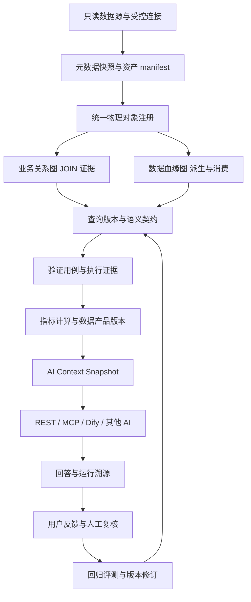

> 类别：待办
>
> 状态：**已执行（2026-08-23 S0–S12：代码与隔离验收完成，A01–A34 中 33 项 PASS、A25 代码 PASS 待生产开关；生产 apply/发布/Git 未授权未执行；逐阶段证据见 §16.1，验收矩阵见 §16.2）**；作为 `55_系统未完成事项统一执行计划.md` 下的多 AI 精准取数专项计划
>
> 制定日期：2026-08-22
>
> 最近修订：2026-08-23（v1.1：补充断点续跑协议、逐阶段出口标准、权限点清单、统一错误分类、调用方身份、AST 选型与方言矩阵、时间/期间语义、legacy 运行策略、黄金用例规模与评测集隔离、数据保留策略、容量与性能门禁 A33/A34、风险登记、功能开关命名、旧 API 废弃策略）
>
> 适用范围：`backend/`、`frontend/`、`tools/`、`取数/`、机器可读资产包、平台 `asset` schema、AI/MCP/Dify 只读协作接口、数据目录/关系/血缘/质量协同
>
> 安全边界：业务源库只允许 `SELECT`；本计划不授权业务源库 DML/DDL，不授权自动批准关系，不授权开启生产查询调度，不授权 Git push/tag 或生产 apply；这些外部动作必须由执行该计划时的用户指令明确覆盖

# 系统整体评估与多 AI 精准取数持续改进一次性执行计划

## 0. 结论先行

当前系统已经拥有可复用的数据资产平台骨架，不需要推倒重建：元数据目录、正式关系、关系配方、查询版本、指标版本、数据产品、只读连接器、AI 工具目录、质量模块、图谱和审计均已存在。真正制约“其他 AI 查数越来越准确”的，不是缺少聊天模型，而是缺少一条可以证明统计口径、结果、版本和纠错过程的确定性链路。

本次只读评估确认了 8 个必须优先解决的事实：

1. 查询执行虽然保存了参数和参数哈希，却没有把参数传给数据库连接器；参数化 SQL 不能按记录参数可靠执行。
2. 查询运行、指标引用和数据产品固定版本的状态门禁不完整，候选、历史或非现行版本可能被调用或绑定。
3. 指标产品目前主要返回指标说明或执行一条关联查询，没有统一完成分子、分母、公式、除零、维度和结果登记。
4. 查询结果哈希只覆盖行数和样本数，不能证明结果内容一致，也不能用于多 AI 对账和回归。
5. SQL、大表、元数据、关系和粒度门禁以正则和宽松提示为主；`HIS.LAB_RESULT` 等硬约束可能被普通 `WHERE` 绕过。
6. AI 上下文未统一使用物理对象键、快照、数据截至时间和质量状态，同名表可能跨来源串线。
7. 平台记录了 AI 工具调用和 SQL 草稿，但没有“回答—运行—反馈—修订—回归评测”闭环，无法度量并持续提高正确率。
8. 查询中心可以查看和提交基础资产，但缺少类型化 API、参数表单、结果追溯、权限分层、反馈入口和准确性看板。

因此，本计划的目标不是让 AI 自由生成更多 SQL，而是让其他 AI 优先使用已认证的数据产品；确需生成新 SQL 时，必须经过“精确元数据—正式关系—语义契约—限量执行—回归用例”五层门禁，并让每一个最终统计回答都可以回放。

## 1. 计划定位及与现有文档的关系

本文件是 `55` 下的专项执行计划，不是新的平行总计划。

| 既有资产 | 本计划处理方式 |
|---|---|
| `126_AI查询SQL与统计指标闭环治理建设计划.md` / `128` | 复用查询、指标、产品、运行和调度底座；补强准确性、版本、参数、反馈和评测，不重建同名主档 |
| `87_AI视图SQL生成与平台对接说明.md` | 保留只读、关系证据和 SQL 草稿规范；把文档要求落实为机器门禁和统一上下文契约 |
| `130_系统完成度盘点与一次性开发升级执行计划.md` | 继续负责统一应用发布、回滚和生产验收；本计划补充其未展开的多 AI 查数准确性任务 |
| `138_数据目录血缘质量协同治理与系统完善改进计划.md` | 直接复用“两张图、一个目录、一条事件链”和精确对象键；其首期静态血缘必须与本计划的查询—指标—产品来源链同时落地 |
| Dify AI 质控代码 | 已有质量摘要、输出校验、人工接受/拒绝能力；不重复开发。查询准确性反馈与 Dify 质量建议是两条不同业务链，只复用安全摘要、digest、复核和审计模式 |
| `数据资产_*/` 机器资产包 | 继续作为平台不可用时的回退证据，但必须增加同批次 manifest、哈希和数量门禁 |
| `.agents/skills/query-governance-intake` 及各只读 SQL 技能 | 继续作为其他 AI 的入口；实施后升级为优先调用平台认证工具、禁止依赖聊天记忆 |

如果本文件与运行时 OpenAPI 或当前代码不一致，以执行时的代码和 `/docs` 为准，并先修订本文、README 和 55 后继续。不得用历史文档中的生产计数冒充执行时实况。

## 2. 评估范围、证据和限制

### 2.1 本次已核对

- 启动目录自检：`AGENTS.md`、`开发起步包/README.md`、`55` 和实际文件目录一致，无真实孤儿文件或幽灵条目。
- 查询治理：`query_gate.py`、`query_intake.py`、`query_runner.py`、`query_impact.py`、`query_relation_extract.py`、查询 API、模型和迁移。
- 指标与产品：`metric_service.py`、`metric_result_import.py`、`data_product_service.py`、指标/产品 API、模型和迁移。
- AI 接口：`ai.py`、AI session/tool call/SQL draft 模型、查询/指标/产品 AI context、MCP 风格目录、Dify AI 质控模块。
- 数据目录与血缘：`AssetTable` 物理身份、`AssetViewDependency`、lineage API、图谱、关系资产和 138 计划。
- 前端：查询中心、AI 上下文、AI 工具、AI 质控、血缘、关系图谱、质量页面和路由权限。
- 本地资产：数据中心资产包 865 表、26,894 条解析字段记录、103 条关系；HIS 源端资产包 1,234 表、19,831 字段、33 条关系；四系统包 1,731 对象、24,021 字段、212 关系候选、729 视图依赖。
- 取数工作区：当前实际可见 393 个文件、123 个 SQL、27 个 `query.yaml`（含 working/outbox/export 重复副本），13 个目录名中含模板和 12 个业务 query code；平台实时资产仍须执行时查询。

### 2.2 本次验证结果

- 前端 `pnpm run typecheck`：通过。
- 前端 `pnpm run build`：通过，gzip 预算通过。
- 前端 `pnpm test`：20 个文件、119 个测试通过。
- 后端不连接数据库的查询指纹、只读连接器和 AI 质控契约专项：26 个测试通过。
- 本地 Alembic 单 head：`aa11bb22cc33`。
- 后端依赖数据库的查询/指标/产品集成测试未进入收集：安全门禁要求显式合法 `APP_TEST_DB_URL`；本次未以 `.env` 或生产库替代，故全量后端回归不得记为通过。
- 本地分支相对 `origin/master` 超前 3 个提交；制定计划时工作区无未提交改动。
- 注意：本节所有计数与 Git 状态均为 2026-08-22 制定时快照，执行时必须在 S0 重新核对并以实况为准，禁止直接引用本节数字充当执行时证据。

### 2.3 本次没有执行

- 没有连接任何业务源数据库，没有运行统计 SQL。
- 没有读取服务器受控凭据，没有查看或输出患者明细。
- 没有修改平台库、测试库、生产容器、前端软链接、调度或权限。
- 没有执行 Git commit、push、tag 或生产发布。

## 3. 工程成熟度评估

以下分数是用于排优先级的工程成熟度判断，不是业务统计准确率，也不能作为上线证明。

| 领域 | 成熟度 | 结论 |
|---|---:|---|
| 元数据目录与多源资产 | 8/10 | 覆盖面和证据丰富；缺统一 manifest、快照新鲜度和全链路物理对象键 |
| 业务关系与配方 | 7/10 | 已有 A/B/C/D、活库验证和草稿复核；AI 上下文仍可能只按表名匹配，配方消费证据不完整 |
| 关系图谱与静态血缘 | 6/10 | 业务图谱可用，视图依赖已有大量证据；血缘模型过薄，影响分析仍有模糊匹配 |
| 查询资产治理 | 5/10 | 版本、hash、运行和门禁骨架齐全；参数执行、状态、语义和元数据核验存在 P0 缺口 |
| 指标准确性 | 4/10 | 有定义、版本和结果表；缺统一计算引擎、数值契约、维度唯一键和可复现对账 |
| 数据产品 | 5/10 | 禁止任意 SQL、已有目录和参数白名单；版本固定、参数类型、限流和指标计算不完整 |
| 外部 AI 消费 | 4/10 | 有 REST/MCP 风格目录和上下文；缺统一入口、来源快照、认证等级、真实工具映射和结果证据包 |
| 反馈与持续学习 | 2/10 | 仅有调用审计和 SQL 草稿反馈；没有查数回答正确性、黄金用例、回放评测和改进趋势 |
| 前端运营与解释 | 5/10 | 基础页面可用且构建通过；查询中心过于集中，追溯、反馈、权限和批次展示不足 |
| 安全与只读边界 | 7/10 | 测试库、业务源只读和凭据规则较强；原始异常、参数/审计、AI 可读过滤和字段脱敏仍需加固 |

总体判断：平台处于“资产管理和最小查询产品可用，统计认证与自我改进尚未完成”的阶段。

## 4. 必须修复的代码事实

### 4.1 P0：查询执行参数没有传给连接器

`backend/app/services/query_runner.py` 创建运行记录时保存 `parameters` 和 `parameters_hash`，但调用连接器时只有 SQL 和 `max_rows`。执行 AI 必须首先修复为受控 bind 参数传递，严禁用字符串拼接替代。

完成标准：

- SQL 中 bind 名与 `parameter_schema` 完全一致；未知、缺失、未使用参数均阻断。
- Oracle/PostgreSQL/MySQL/SQL Server/Vastbase 各适配器使用自己的参数风格；调用方不能自行改写值到 SQL。
- 运行记录只保存脱敏/最小参数摘要和不可逆哈希；敏感 ID 不原样返回给外部 AI。
- 日期范围、列表长度、数值范围和最大时间窗按 JSON Schema 校验。

### 4.2 P0：状态和版本引用门禁不闭合

当前查询运行只明确阻断 `blocked`，显式指定版本时可能运行 candidate/superseded；指标查询引用只检查版本存在；产品 `pin_version` 发布时未核验状态。

完成标准：

- 默认执行只允许 `status=active AND is_active=true`。
- 历史重算必须使用单独权限和 `recalc=true`，记录理由、原版本和数据窗口；candidate/blocked 永不执行。
- 指标激活时，主查询、分子查询和分母查询均必须为合法现行版本或明确的已认证固定版本。
- 产品发布时校验 pin version，并新增产品版本或发布 revision，禁止原地静默换口径。
- 所有 active 查询、指标和 enabled 产品无孤儿引用；完整性检查失败即阻断 AI 可用状态。

### 4.3 P0：指标产品没有统一计算引擎

当前指标产品主要返回定义，`execute_sql=true` 也只是运行关联查询。执行 AI 必须实现一个统一的指标计算服务，而不是把公式留给外部 AI 自行计算。

完成标准：

- 支持单结果查询、分子/分母、受限公式、单位和精度。
- 使用 Decimal/数据库 numeric 语义，禁止把核心数值长期保存为自由文本。
- 分母为 0、任一子查询失败、结果截断或缺列时返回 `unavailable/partial`，不得伪装正常值。
- 结果唯一键至少包含 `metric_code + metric_version + period_key + dimensions_hash + parameter_hash + run_batch`。
- 每条结果绑定查询 run、查询版本、来源、数据截至时间、输入参数哈希、公式版本和结果内容 digest。
- 同周期多维度、多批次和重算不得互相覆盖。

### 4.4 P0：SQL 门禁不能证明安全和正确

现有安全检查和依赖解析主要依赖正则。大表 marker 中普通 `WHERE` 即可能通过；`HIS.LAB_RESULT` 的 `TEST_NO` 硬约束没有结构化验证。

完成标准：

- 引入支持现有方言的 SQL AST 解析层；正则只作为 fail-closed 的前置筛查，不作为最终证据。
- 解析失败进入 `unresolved/blocked`，不得默认依赖完整。
- 表和字段必须在指定来源的当前元数据快照中精确存在。
- JOIN 必须命中正式关系、active 配方或明确验证证据；组合键完整，D 类和仅同名字段不得自动通过。
- 计算并校验基表粒度、输出粒度、聚合字段、去重规则和潜在 fanout；多对多未解释时阻断。
- 为每个大表建立结构化策略：`LAB_RESULT` 必须有 `TEST_NO` 限定；费用巨表必须有患者就诊组合键或受控时间范围；拒绝 `WHERE 1=1` 等伪限定。
- Oracle 11g 不生成 `FETCH FIRST`；限量使用 `ROWNUM`，但返回行数限制不能替代源端范围限制。
- AST 解析层必须固定依赖与版本（建议 `sqlglot`，锁定版本并把版本写入 `parser_version` 字段），方言矩阵显式覆盖 Oracle 11g、PostgreSQL、MySQL、SQL Server、Vastbase；未覆盖或解析失败的方言一律 fail-closed 为 `unsupported_dialect`/`unresolved`，不得降级为正则通过。

### 4.5 P0：结果哈希、数据截至时间和错误处理不可信

当前 `result_hash` 只哈希行数和样本数；`data_as_of` 字段未被可靠写入；原始异常可能进入运行记录和 API。

完成标准：

- 结果 envelope 包含列名、类型、规范化排序说明、行数、截断状态、数据截至时间和内容 digest。
- 小型聚合结果对完整规范化结果计算 SHA-256；大型明细只保存安全分块 digest/汇总 digest，不保存患者级原文到 AI 评测表。
- 明确区分 `result_digest`、`summary_digest`、`file_sha256`，禁止一个字段多义。
- `data_as_of` 从查询输出约定、来源水位或运行窗口确定；无法确定时为 `unknown` 并显示警告，不能以运行时间冒充数据截止时间。
- API 只返回安全错误分类、相关 ID 和可操作提示；完整内部异常只进入受控服务日志且先经过 `sanitize_text`。
- 运行详情默认不返回原始敏感参数，只返回 schema、掩码摘要和哈希。

### 4.6 P0：AI 上下文可能串来源或外发不该读取的 SQL

当前部分上下文只按 `schema.table` 或表名匹配；查询 AI context 在没有 `system_code` 时没有稳定执行 `ai_readable` 过滤，并直接返回完整 SQL。

完成标准：

- 全平台对象统一使用：`system_code|source_code|namespace_name|schema_name|object_name|object_type`。
- 关系、血缘、查询依赖和影响分析不得用单表名或 `%ILIKE%` 作为正式匹配结果。
- 所有 AI context 无条件执行 `ai_readable=true`、权限、敏感级别和来源范围过滤。
- 默认返回 SQL hash、参数/输出契约、依赖和限制；完整 SQL 仅对专门权限开放。
- 同名表测试覆盖 ODS 镜像、HIS 源端、OA 和周边系统，任何跨源串线均为发布阻断。

### 4.7 P0：缺少准确性反馈和回归评测

平台现有 AI session/tool call/SQL draft 不能回答某个统计是否正确，也不能把一次纠错转为以后可自动验证的测试。

完成标准：

- 每个 AI 回答绑定问题摘要、上下文快照、所选查询/指标/产品版本、查询 run、结果 digest、`data_as_of` 和回答 digest。
- 用户可反馈：正确、部分正确、错误、证据不足、问题歧义。
- 错误分类至少包含：元数据过期、来源错误、字段错误、JOIN 错误、fanout、过滤错误、时间口径、去重、分子、分母、公式、维度、参数、数据源质量、结果过期、权限/脱敏、性能、回答表述。
- 已审核的纠错可转为评测用例或新版本草稿；不得直接自动发布查询、指标、产品或正式关系。
- 每次查询/指标新版本激活前回放受影响用例；失败则保持 candidate/blocked。
- 准确率只按有人工结论或黄金基准的用例统计；未评价回答不得计为正确。

### 4.8 P0：前端权限和结果解释不足

查询中心路由和按钮权限与后端 `query:create/query:run` 不一致；产品始终用空参数执行；看板将单元格压缩成一个无来源数值。

完成标准：

- 查看、创建、运行、发布、调度、反馈、复核分开权限；后端也必须校验，不能只隐藏按钮。
- 产品执行按 `parameter_schema` 动态生成表单，前端校验失败不发请求。
- 查询 run、指标结果和看板单元格都显示版本、批次、状态、来源、`data_as_of`、限制和相关 ID。
- 区分正常 0、无结果、失败、部分、截断、过期和历史重算。
- 页面和 CSV 都能追溯到同一证据；CSV 不能只导出最终数值。

## 5. 目标架构



设计原则：

1. 业务关系图说明“如何 JOIN”，血缘图说明“数据从哪里到哪里”，两者绝不混用。
2. 平台是唯一事实源；仓库资产包是带 manifest 的只读回退，不是平行主库。
3. AI 不拥有数据库凭据，不接触写执行器；AI 使用的是认证查询或产品，不是任意 SQL。
4. 自动激活仍可保留，但必须通过确定性的硬门禁和评测；人工反馈不直接改变正式资产。
5. 所有“越来越好”必须体现在版本、用例和指标中，不能依赖某个 AI 的聊天记忆。

## 6. 统一 AI 上下文与结果契约

### 6.1 Context Snapshot

新增统一上下文构建服务和版本化 JSON Schema，至少返回：

```json
{
  "schema_version": "ai-data-context/v1",
  "context_id": "ctx_...",
  "generated_at": "2026-08-22T00:00:00Z",
  "expires_at": "2026-08-23T00:00:00Z",
  "manifest_hash": "sha256:...",
  "metadata_snapshots": [],
  "source_capabilities": [],
  "objects": [],
  "columns": [],
  "business_relations": [],
  "lineage_edges": [],
  "recipes": [],
  "queries": [],
  "metrics": [],
  "products": [],
  "quality_status": [],
  "reviewed_feedback": [],
  "warnings": [],
  "unresolved": [],
  "truncated": false
}
```

每个对象必须带 `object_key`；每个关系必须带验证等级、状态、证据、验证时间和来源快照；每个查询/指标/产品必须带精确版本、内容 hash、认证状态、限制和数据新鲜度。

### 6.2 Query Result Envelope

所有 AI 和数据产品只消费统一结果 envelope：

```json
{
  "run_id": 1,
  "query_ref": "QRY_CODE@3",
  "source_code": "controlled_source",
  "parameter_hash": "sha256:...",
  "status": "success|partial|failed|unavailable",
  "row_count": 1,
  "truncated": false,
  "data_as_of": "2026-08-21T23:59:59Z",
  "result_digest": "sha256:...",
  "columns": [],
  "safe_summary": {},
  "warnings": [],
  "lineage_snapshot_id": 1,
  "context_id": "ctx_...",
  "correlation_id": "..."
}
```

患者级样本不得进入外部 AI context、反馈或评测用例。确需人工查看时走现有 RBAC、脱敏和审计页面，不进入回答 envelope。

统一时间与期间语义：`data_as_of` 一律以 UTC ISO-8601 存储和返回，展示层标注来源系统时区；`period_key` 采用 `YYYY-MM-DD`（自然日）或在指标 semantic contract 中显式声明的医院日/账期口径，禁止同一指标混用口径；`run_batch` 采用 `UTC日期+批次序号` 的确定性格式，禁止用本地时间自由文本。时间口径不确定时按 §4.5 以 `unknown` 处理并告警。

### 6.3 AI 回答规则

其他 AI 的每个统计回答必须同时输出：

- 统计结论和单位；
- 时间范围与数据截至时间；
- 查询/指标/产品精确版本；
- 运行 ID 和结果 digest 短摘要；
- 采用的关系/配方证据；
- 已知限制、截断、过期或未解析状态；
- 反馈入口或 `feedback_id`。

遇到 stale、unresolved、candidate、quality_failed、partial 或 truncated 时，AI 必须显式告警；不能将不确定结果写成确定事实。

## 7. 新增和调整的数据模型

所有迁移手写，继续使用 `asset` schema 和 `asset_<模块>_<实体>` 前缀；执行前读取当前 Alembic 单 head，不得硬猜 down_revision。

### 7.1 查询与指标现有表调整

建议以兼容列和新表增量实现，不删除 126 旧表：

| 对象 | 主要增补 |
|---|---|
| query definition/version | certification_status、metadata_snapshot_id、lineage_snapshot_id、validated_at、validation_digest、parser_version、unresolved_reason、semantic_contract JSONB |
| query dependency | object_key、column_key、evidence_type、evidence_ref、resolution_status、relation/recipe typed ref |
| query run | safe_parameters_summary、data_as_of_source、result_digest_version、schema_digest、source_snapshot_id、error_class、correlation_id、recalc_reason |
| metric version | calculation_type、precision、rounding_mode、certification_status、formula_ast/hash、dimension_schema、query ref validation status |
| metric result | Numeric 数值列、dimensions_hash、parameter_hash、run_batch、result_digest、source_snapshot_id、unique business key |
| data product | 产品版本或 revision、validated pin ref、source policy、rate/concurrency quota、result contract、certification status |

### 7.2 新增准确性闭环表

| 表 | 用途 | 禁止内容 |
|---|---|---|
| `asset_ai_context_snapshots` | 保存上下文 manifest、对象/版本引用和 digest；大 payload 用受控对象存储引用 | 患者明细、凭据、完整敏感 SQL |
| `asset_ai_answer_events` | 绑定问题摘要、模型/prompt/tool 版本、context、资产版本、run、answer digest | 原始患者问题全文、原始明细结果 |
| `asset_ai_feedback` | 正确性、完整性、新鲜度、错误类型、审核状态、修订引用 | 未脱敏自由文本、直接发布标记 |
| `asset_query_evaluation_cases` | 黄金问题/固定参数 schema、预期结构、断言、容差、证据和影响资产 | 真实患者标识和明细基线 |
| `asset_query_evaluation_runs` | 新版本回放结果、断言、差异、pass/fail 和 digest | 大型原始结果 |
| `asset_metric_runs` | 分子/分母/公式执行及指标结果链 | 自由文本数值、无来源结果 |
| `asset_asset_manifests` | 资产包批次、文件 hash、行数、来源快照和导入状态 | 凭据路径内容、未脱敏样本 |

所有外键、唯一约束、状态 check、索引和 `ON DELETE` 策略必须明确；删除正式历史版本不是正常流程，默认只允许停用/过期。

数据保留策略：`asset_ai_context_snapshots` 与 `asset_ai_answer_events` 默认保留 90 天，到期删除大 payload 引用但保留 digest、计数和版本引用；`asset_ai_feedback`、`asset_query_evaluation_cases/runs` 长期保留；清理任务必须幂等、可配置、仅操作平台 `asset` schema，绝不触碰业务源库。迁移按模块拆分为多个单一职责 revision（查询门禁、指标计算、血缘、反馈评测各自独立），每个 revision 可独立 downgrade 并在隔离库验证，禁止一个巨型 revision 混合多模块变更。

### 7.3 反馈状态机

```text
submitted
  → triaged
  → accepted | rejected | needs_business_confirmation
  → revision_draft
  → evaluation_running
  → resolved | regression_failed
```

反馈只能生成候选修订和评测用例。正式关系、查询、指标或产品的状态仍由各自门禁决定。

## 8. 后端文件级实施任务

### 8.1 查询执行与门禁

修改：

- `backend/app/services/query_runner.py`
- `backend/app/services/query_gate.py`
- `backend/app/services/query_intake.py`
- `backend/app/services/query_fingerprint.py`
- `backend/app/services/query_relation_extract.py`
- `backend/app/services/query_impact.py`
- `backend/app/services/quality_rule_engine.py`
- `backend/app/services/db_connectors.py`
- `backend/app/services/quality_sql_runner.py`
- `backend/app/schemas/query_asset.py`
- `backend/app/api/v1/queries.py`

新增建议：

- `backend/app/services/sql_ast.py`
- `backend/app/services/query_parameter_validator.py`
- `backend/app/services/query_semantic_validator.py`
- `backend/app/services/query_result_digest.py`
- `backend/app/services/query_source_policy.py`
- `backend/app/services/query_evaluation_service.py`

关键要求：参数 bind、状态门禁、精确来源、AST、元数据/关系/粒度校验、结果 digest、`data_as_of`、安全错误、评测回放必须由后端完成。

### 8.2 指标和数据产品

修改：

- `backend/app/services/metric_service.py`
- `backend/app/services/metric_result_import.py`
- `backend/app/services/data_product_service.py`
- `backend/app/models/metric_asset.py`
- `backend/app/models/data_product.py`
- `backend/app/api/v1/metrics.py`
- `backend/app/api/v1/data_products.py`

新增建议：

- `backend/app/services/metric_calculation_service.py`
- `backend/app/services/metric_formula_validator.py`
- `backend/app/services/data_product_rate_limit.py`
- `backend/app/models/ai_accuracy.py`
- `backend/app/schemas/ai_accuracy.py`

关键要求：非现行引用阻断、真实指标计算、Numeric/Decimal、维度唯一键、批次/重算、固定版本、来源策略、调用限流和结果追溯。

### 8.3 统一对象、血缘和上下文

修改：

- `backend/app/models/lineage.py`
- `backend/app/api/v1/lineage.py`
- `backend/app/api/v1/ai.py`
- `backend/app/api/v1/recipes.py`
- `backend/app/api/v1/graph.py`
- `backend/app/api/v1/metadata_changes.py`
- `backend/app/models/asset_system.py`

新增建议：

- `backend/app/services/object_identity.py`
- `backend/app/services/lineage_ingest.py`
- `backend/app/services/ai_context_builder.py`
- `backend/app/services/ai_feedback_service.py`
- `backend/app/services/asset_manifest_service.py`
- `backend/app/api/v1/ai_accuracy.py`

关键要求：落实 138 首期 `asset_lineage_edges`、精确 object_key、静态视图/查询/指标/产品引用、无模糊回退、来源新鲜度和统一 context snapshot。

### 8.4 权限、审计与脱敏

修改：

- `backend/app/models/ai_collab.py`
- `backend/app/services/data_masking.py`
- `backend/app/api/v1/ai.py`
- 权限种子和现有审计服务

要求：

- AI 草稿审核、执行、反馈复核、评测运行分别配置最小权限。
- `tool-execute` 审计不保存完整参数和自由 SQL；保存安全摘要、digest 和 correlation id。
- 补齐医院标识字段敏感分类；默认不向外部 AI 返回 `PATIENT_ID`、住院号、门诊号、检查号、检验号等行级标识。
- 无法确认字段安全等级时 fail-closed。

权限点清单（后端强制校验，前端只控制展示，缺一即 A28 不通过）：`query:view`、`query:create`、`query:run`、`query:publish`、`query:schedule`、`query:recalc`、`metric:calculate`、`product:publish`、`ai:context:read`、`ai:sql:full_read`、`feedback:create`、`feedback:review`、`evaluation:run`、`evaluation:view`、`lineage:view`。新权限必须进种子脚本，默认不授予既有角色，并附直接调 API 返回 403 的契约测试。

## 9. API 与 AI 工具契约

保留现有路径以兼容前端和既有 AI，新增统一能力：

| 方法 | 路径/工具 | 作用 |
|---|---|---|
| POST | `/api/v1/ai/context/resolve` | 按问题、系统、来源、业务域和对象上限构建上下文快照 |
| GET | `/api/v1/ai/context/{context_id}` | 读取可复现上下文和过期/截断状态 |
| POST | `/api/v1/queries/{code}/versions/{version}/validate` | 运行元数据、关系、语义和评测门禁 |
| GET | `/api/v1/queries/{code}/versions/{version}/validation` | 查看逐层验证证据 |
| POST | `/api/v1/metrics/{code}/versions/{version}/calculate` | 受控计算指标并登记 metric run/result |
| POST | `/api/v1/ai/answers` | 登记 AI 回答 provenance，不保存敏感全文 |
| POST | `/api/v1/ai/feedback` | 提交绑定版本/run/context 的反馈 |
| PATCH | `/api/v1/ai/feedback/{id}/review` | 审核、分类并关联修订/评测用例 |
| GET | `/api/v1/ai/feedback/{id}` | 查询解决状态和新版本引用 |
| POST | `/api/v1/ai/evaluations/run` | 对候选或现行版本回放受影响用例 |
| GET | `/api/v1/ai/evaluations/dashboard` | 返回有基准的准确率、失败类型和趋势 |
| GET | `/api/v1/lineage/impact` | 改为精确 object_key，返回查询/指标/产品 typed nodes/edges |

MCP/工具目录至少映射以下真实可执行只读工具，目录与 `tool-execute` 不得再出现“列出来但 unsupported”：

- `resolve_query_intent`
- `get_certified_context`
- `search_certified_queries`
- `explain_metric`
- `execute_data_product`
- `validate_query_result`
- `get_lineage_impact`
- `submit_feedback`
- `get_feedback_status`

每个工具必须有 JSON Schema、只读/平台写说明、权限、上限、错误码、示例和契约测试。`submit_feedback` 只写平台反馈表，不得写业务源库或自动发布资产。

统一错误分类（API 只返回分类码、相关 ID 与安全提示，内部细节只进受控日志）：`E_AUTH`、`E_PARAM`、`E_STATE`、`E_SOURCE`、`E_METADATA_STALE`、`E_RELATION`、`E_FANOUT`、`E_SEMANTIC`、`E_SAFETY`、`E_LIMIT`、`E_INTERNAL`；`E_INTERNAL` 不得携带堆栈、SQL 原文或连接信息。

调用方身份：每个外部 AI/集成必须先注册 `caller_id`（含用途、责任人和配额），answer event、run、feedback 与限流键均以 `caller_id` 归属；未注册调用方仅允许只读目录类工具，不允许执行产品或提交反馈。

旧 AI context 端点保留一个里程碑作为兼容层，响应带 `Deprecation`/`Sunset` 头并在文档标注替代路径；新前端与新 AI 一律使用本节统一契约。

## 10. 前端实施任务

保留现有 `/queries` 路由和视图路径，避免破坏书签及权限配置。

### 10.1 查询中心拆分与类型化

- 扩展现有 `frontend/src/api/*.ts`，建立 Query/Metric/Product/Run/Feedback/Evaluation 类型；页面禁止继续新增 `http.request<any>`。
- 将 `src/views/query-center/queries/index.vue` 拆为同目录组件，但不改路由：查询列表、版本详情、运行详情、指标、产品、看板、调度、反馈、评测。
- 查询/指标/产品/运行列表全部支持服务端分页、筛选和空/错/权限状态。
- 查询详情展示门禁层、依赖、关系/配方证据、输出 schema、粒度、限制、版本 diff、评测和影响范围。
- 运行详情展示参数安全摘要、来源、数据截至、结果 digest、截断、错误分类和 correlation id。
- 产品执行动态渲染参数表单；日期/枚举/范围和必填项与后端一致。

### 10.2 指标与看板

- 指标详情展示定义、公式 AST 摘要、分子/分母、包含/排除、去重、维度、版本和认证状态。
- 看板单元格返回并展示 metric/query 版本、run batch、source、snapshot、`data_as_of`、status、recalc、限制。
- 同周期多批次不静默覆盖；允许按维度和批次切换。
- 导出 CSV 同步带 provenance 列，且服从同一脱敏与行级权限；CSV 导出计入审计。

### 10.3 反馈与准确性运营

- 查询、指标、产品、运行结果和 AI 回答均提供反馈入口。
- 反馈表单支持正确/部分/错误/证据不足/歧义、错误类型、脱敏说明和建议修订。
- 复核页面支持关联新版本草稿、评测用例和解决记录，但没有“直接升正式关系/active 查询”按钮。
- 准确性看板只统计已审核反馈和黄金用例，展示样本量、通过率、回归失败率、常见错误、修订后提升和未评价量。
- 不允许用“全部调用数”作准确率分母，也不允许把无反馈视为正确。

### 10.4 AI 上下文、图谱和质控

- AI 上下文页面显示 schema version、context id、manifest hash、快照、生成/过期时间、来源、关系等级、截断和 unresolved。
- 图谱明确区分业务关系/数据血缘，展示验证时间和下游查询/指标/产品。
- AI 工具页面展示完整契约、权限、上限和真实支持状态。
- Dify AI 质控页面补齐已有类型中的 confidence、证据问题、后续检查、限制、prompt/schema/input/output digest，并增加有限轮询、超时和错误分类；不与查数反馈表混为一张表。

### 10.5 权限与可访问性

- 查看、创建、运行、发布、调度、反馈、复核按钮使用各自权限；直接调 API 同样 403。
- 请求失败不再静默显示空列表；显示 HTTP 状态、错误分类、correlation id 和重试。
- 重要状态不能只靠颜色；补键盘焦点、aria 标签和 403/409/422/503 页面测试。

## 11. 机器可读资产包和取数工作区

### 11.1 资产 manifest

当前 `数据资产_资产包/catalog.json` 是核心摘要（45 表、73 关系），而 CSV 是全量清单（865 表、26,894 字段、103 关系）；catalog 没有全量 columns。两者用途不同却缺少机器可判别的 manifest，外部 AI 容易把摘要当全量。

修改 `tools/build_asset_package.py` 和各新源构建器，统一生成 `manifest.json`：

- `schema_version`、`asset_version`、`generated_at`、`data_as_of`；
- system/source/namespace 范围；
- 元数据/关系验证 snapshot id；
- 每个文件的角色（summary/full/candidate/evidence）、行数、SHA-256、编码；
- catalog 摘要覆盖范围和不得当作全量的标记；
- 构建器/parser 版本、导入批次和导入结果摘要；
- PII/凭据扫描结论。

构建和 CI 必须验证 manifest、CSV、JSON 计数和 hash；同批文件不一致则失败。外部 AI 回退读取必须先读 manifest。

### 11.2 取数包契约

扩展 `query.yaml`，至少包含：

- query code、系统、来源、方言、用途和 owner；
- 参数 JSON Schema；
- output schema、grain、dimensions、time semantics；
- include/exclude/dedup/null 口径；
- 表/字段 object key；
- relation/recipe/evidence refs；
- metadata snapshot、validation cases、limitations；
- SQL/content hash 和 parent version。

`queryctl validate` 本地检查文件和 SQL 基础规则；平台仍是最终事实源。working/outbox/synced 的同 query code 必须显示状态和平台版本，避免 AI 从旧副本取错。

### 11.3 技能升级

更新 `.agents/skills/query-governance-intake/SKILL.md` 及必要引用：

1. 先 `resolve_query_intent` 搜认证产品/查询/指标；命中则复用，不重写 SQL。
2. 未命中才按来源技能查元数据和关系。
3. 每次执行必须回传 context/query/run/result refs。
4. 回答末尾提供反馈方式。
5. 被用户纠正时提交反馈并关联新版本草稿，不能只在聊天里道歉。
6. 平台不可用才读 manifest 指向的仓库资产；过期/不完整必须明示。

## 12. 准确性门禁和评分

不得让模型自己给一个主观 confidence 代替验证。平台准确性状态由以下确定性层组成：

| 层 | 门禁 | 失败处理 |
|---|---|---|
| G0 安全 | 单 SELECT、无 DDL/DML、来源只读、参数绑定、大表策略、敏感输出 | blocked |
| G1 结构 | 来源/表/字段精确存在，元数据快照未过期 | blocked 或 stale |
| G2 关系 | JOIN 命中关系/配方证据，组合键、基数和 fanout 合法 | blocked/unresolved |
| G3 语义 | 粒度、时间、维度、纳排、去重、null、输出 schema 完整 | candidate |
| G4 执行 | 限量验证成功、无截断冒充、结果 schema/断言通过 | candidate/partial |
| G5 回归 | 所有受影响黄金用例和不变量通过 | validated |
| G6 认证 | 来源新鲜、无未解决 P0 反馈、完整 provenance | certified |

`active` 表示当前默认版本，`certified` 表示达到 AI 统计认证标准，二者使用独立字段，避免破坏现有状态机。现有 active 资产迁移后标记 `legacy_unverified`，先继续人工可见，但不对外宣称 certified；按使用频率逐批补评测，不得突然全部停用生产查询。

`legacy_unverified` 运行策略：人工在平台内按原权限执行允许，但结果 envelope、运行详情和看板必须显式标注 `legacy_unverified`；AI 工具默认只检索和推荐验证完整的 certified/active 资产；legacy 版本不得被新产品 pin、不得计入认证覆盖率、不得作为黄金用例基准。

黄金用例与评测集规则：首批目标 ≥30 条，覆盖 HIS/ODS/OA/移动护理/Docare 核心查询与指标，全部使用合成数据或聚合断言；评测集独立版本化（`evaluation_set_version`）并与日常反馈表隔离，未人工审核的反馈永远不得直接成为黄金基准；新版本激活回放必须固定用例版本，保证结果可复现。

准确性看板至少显示：

- 已认证查询/指标/产品覆盖率；
- 有人工结论的回答数、正确/部分/错误分布；
- 黄金用例通过率和回归失败率；
- stale context 比例、unresolved 依赖数、同名对象冲突数；
- JOIN/fanout/时间口径/去重等错误分类趋势；
- 反馈首次响应和解决周期；
- 新版本相对旧版本在同一评测集上的提升/退化。

禁止展示没有样本量、基准和时间窗的“总体准确率”。

## 13. 一次性实施顺序

执行 AI 收到用户明确的“按 144 执行”后，应按 `S0 → S12` 连续推进。内部普通缺陷就地修复并重测，不反复等待用户；只有第 13.1 节的真实授权/环境阻断才停止对应外部动作，其余可完成项继续。

逐阶段出口标准（每个 S 阶段完成时必须同时满足，缺一不可进入下一阶段）：

1. 该阶段新增/修改的测试全部通过；
2. 既有基线零回归：后端不连库专项 26 项、前端 119 项、双 typecheck、build/gzip 全部保持通过；
3. 把该阶段状态、真实测试计数、修改文件和阻断实时写入 144 文末执行记录，再进入下一阶段。

断点续跑协议：执行记录是续跑的唯一依据。若执行中断（上下文耗尽、环境故障或用户中止），后续 AI 必须先读 144 文末执行记录，从最后一个完成阶段的下一阶段继续；不得重复已完成阶段，不得推翻已有结论，不得凭记忆补写未执行的阶段。

### S0：建立只读基线和变更清单

- 重读 AGENTS、README、55、126/128、130、138、144、`取数/START_HERE.md`。
- 目录自检、`git status/diff/log`、远端差异、Alembic heads。
- 只读核对运行环境的查询/指标/产品/调度、迁移、Dify 开关、数据源状态和元数据新鲜度；不能连接时记录真实阻断。
- 输出文件所有权清单；若使用 Luna，禁止多个 AI 修改同一文件，主 AI 统一复核。

### S1：先写失败测试固定 P0 缺陷

新增或扩展测试，至少覆盖：

- 参数确实传入连接器；未知/缺失/未使用参数阻断。
- candidate/blocked/superseded 查询不能默认执行。
- blocked/candidate 查询不能激活指标或发布产品。
- `LAB_RESULT WHERE 1=1` 被阻断，`TEST_NO` 受控限定通过。
- 同行数不同结果 digest 不同。
- 无 system filter 的 AI context 仍过滤 `ai_readable=false`。
- 同名表跨 source 不串线。
- 原始异常和敏感参数不进入 API/audit。

先确认测试在旧代码上按预期失败，再进入 S2；不得编写永远通过的空断言。同时在 S1 开始前冻结并记录既有基线（后端不连库专项与前端套件的真实通过数），后续每阶段对比，基线被破坏视同该阶段未完成。

### S2：修复查询执行和来源安全

- 落实参数 bind、JSON Schema、状态、source policy、超时/最大行数和安全错误。
- 结构化大表策略和 SQL AST 前置门禁。
- 结果 digest、schema digest、`data_as_of` 和 correlation id。
- 修复 capabilities：未知 dialect 不得默认 supported，返回真实已配置/已测试/只读/参数化能力。

### S3：实现元数据—关系—语义验证

- exact object key 和当前快照解析。
- AST 表/字段/CTE/JOIN 依赖；无法解析进入 unresolved。
- 关系/配方证据、组合键、基数/fanout。
- 查询 semantic contract 和逐层 validation report。
- 现有 active 迁移为 legacy_unverified，避免中断。

### S4：实现指标计算与产品版本

- 指标 formula validator/calculation service/metric run。
- Numeric/Decimal、除零、partial/unavailable、维度唯一键和批次。
- pin version、产品版本/修订、显式 allow_data_product、source policy、限流。
- 修复看板按版本/维度/批次选择结果。

### S5：落实 138 首期静态血缘

- 手写迁移和 `asset_lineage_edges`。
- 导入视图依赖、查询依赖、查询→指标→产品确定性引用。
- 业务 JOIN 边不进入血缘；模糊表名回退删除。
- 幂等 dry-run、二次零写验证、unresolved 清单。

### S6：统一 AI context 和真实 MCP 工具

- context snapshot、统一 JSON Schema、过期/截断/质量状态。
- 修复旧 system/export/query/metric/product context 的兼容层。
- MCP catalog 与 tool execute 一一映射，补 OpenAPI/JSON Schema 契约测试。
- 默认不返回完整 SQL和行级标识；按权限提供受控详情。

### S7：反馈、评测和持续改进

- 新模型、服务、API、权限和审计。
- 反馈→分类→修订草稿→评测→解决状态机。
- 从已人工确认的核心查询建立首批黄金用例（≥30 条，覆盖五系统核心域）；用合成/聚合断言，不保存患者明细。
- 评测集独立版本化（`evaluation_set_version`），与生产反馈表隔离；回放时固定用例版本，结果可复现。
- 新版本激活前回放影响用例；结果差异可解释。
- 准确性 dashboard 只统计有基准数据。

### S8：前端完整落地

- 类型化 API、查询中心组件拆分、分页/筛选/详情。
- 参数表单、运行 provenance、看板批次、反馈/评测/准确性页面。
- AI context、MCP 工具、血缘、图谱和 Dify 解释增强。
- 权限、错误状态、可访问性和 CSV provenance。

### S9：资产包、queryctl 和技能收口

- manifest/hash/count 契约和构建器测试。
- query.yaml 语义契约、queryctl 校验、重复副本状态提示。
- 更新 query governance skill 和 AI 标准执行提示词。
- 更新 87/126/128/138 中与实现不一致的当前说明，避免其他 AI 走旧路径。

### S10：隔离测试和完整回归

- 仅使用明确指向隔离测试库的 `APP_TEST_DB_URL`。
- 手写迁移完成 `upgrade head → downgrade -1 → upgrade head`；生产不得 downgrade。
- 后端全量 pytest；前端 Vitest、双 typecheck、build/gzip。
- SQL 方言、同名表、敏感数据、权限、幂等、并发、限流、超时、回滚专项。
- 隔离库种子只使用合成元数据与合成业务夹具，禁止从生产复制任何患者明细或真实凭据。
- 并发/事务专项：同周期同维度并发 metric run 不产生重复或互相覆盖的结果（唯一键+事务或 advisory lock）；评测回放与新版本激活必须串行化，防止激活在回放完成前生效。
- 性能冒烟：记录 context 构建（对象上限内）与产品执行的 p95；默认预算 context≤5s、产品执行≤30s，可按环境调整但必须记录实际值；超预算如实登记 PARTIAL，不得静默通过。
- 测试失败必须修复或标记真实阻断，禁止只改预期掩盖问题。

### S11：可发布物和生产前门禁

- `git diff --check`、秘密/PII/凭据扫描、依赖检查、OpenAPI 写权限扫描。
- 从同一 clean SHA 构建后端和前端不可变产物。
- 生成迁移清单、数据变更 dry-run、资产 manifest 和回滚步骤。
- 默认保持查询调度、Dify 自动推送和业务写开关现状；不因发布而自动启用。

### S12：受控生产升级、验收和文档收口

仅在执行请求明确授权生产平台 apply、应用发布和 Git 操作时执行：

- 先备份平台库、当前镜像/前端、环境和调度配置；验证备份可读。
- 只读核对生产当前 head，再升级；禁止生产 downgrade。
- 同一 SHA 原子发布；健康、OpenAPI、RBAC、查询/指标/产品/context/feedback/evaluation/lineage 冒烟。
- 使用合成或无患者明细的小型聚合用例做真实 E2E；业务源库只读。
- 1440×900 浏览器验收，控制台和非预期网络错误为 0。
- 二次 dry-run 零写、回滚演练和版本记录。
- 更新 README、55 执行日志和 144 状态；若生产未获授权，标记“代码/隔离验收完成，生产未执行”，不得伪造上线。

### 13.1 允许停止的硬阻断

仅以下情况可以停止对应动作并请求用户：

1. 缺合法隔离 `APP_TEST_DB_URL`，且无法安全建立；绝不回退生产库。
2. 需要生产平台迁移、服务器发布、Git push/tag，但执行请求没有明确授权。
3. 需要业务源库或目标业务库写入；本计划永不自动授权。
4. 远端 Git 出现非快进、分叉或未知提交，无法无损处理。
5. 生产备份失败、目标环境身份不明、迁移多 head 或数据冲突不可逆。
6. 需要新的业务口径裁决，且不同选择会改变统计含义；保持 candidate/blocked，不猜。
7. 真实患者数据无法在不出域、不持久化、不外发的条件下完成验证。

单一来源暂不可用、某一用例待业务确认或 Dify Key 缺失，不阻断其他独立开发和测试任务；如实登记后继续。

## 14. 测试和验收矩阵

### 14.1 后端新增测试建议

- `tests/plan144/test_query_parameter_binding.py`
- `tests/plan144/test_query_version_state_gate.py`
- `tests/plan144/test_query_source_policy.py`
- `tests/plan144/test_query_big_table_policy.py`
- `tests/plan144/test_query_ast_and_metadata.py`
- `tests/plan144/test_query_relation_fanout.py`
- `tests/plan144/test_query_result_digest.py`
- `tests/plan144/test_metric_calculation.py`
- `tests/plan144/test_metric_dimensions_batch.py`
- `tests/plan144/test_data_product_version_and_rate.py`
- `tests/plan144/test_object_identity_isolation.py`
- `tests/plan144/test_lineage_static_edges.py`
- `tests/plan144/test_ai_context_contract.py`
- `tests/plan144/test_ai_context_authorization.py`
- `tests/plan144/test_ai_feedback_loop.py`
- `tests/plan144/test_ai_evaluation_regression.py`
- `tests/plan144/test_sensitive_audit_redaction.py`
- `tests/plan144/test_mcp_tool_contract.py`

### 14.2 硬验收

| 编号 | 场景 | 通过标准 |
|---|---|---|
| A01 | 参数执行 | bind 参数真实到达连接器，缺失/多余/类型错误均阻断 |
| A02 | SQL 注入 | 参数值不能改变 SQL 结构，多语句和注释注入拒绝 |
| A03 | 大表 | LAB_RESULT 无 TEST_NO 约束的查询全部阻断 |
| A04 | 状态 | candidate/blocked/superseded 不可默认运行或被指标/产品引用 |
| A05 | 来源 | disabled、非只读、凭据异常、schema 不属来源均拒绝 |
| A06 | 对象身份 | 不同 source 的同名表串线为 0 |
| A07 | 元数据 | 表/字段不存在或快照过期有明确 blocked/stale 状态 |
| A08 | 关系 | 正式 JOIN 均有 typed evidence；D/候选不自动通过 |
| A09 | 组合键 | PATIENT_ID+VISIT_ID 等不得退化为单键 |
| A10 | fanout | 未解释的多对多膨胀被检测并阻断 |
| A11 | 语义 | grain/时间/纳排/去重/null/output schema 完整 |
| A12 | digest | 同行数不同内容 digest 不同；同规范结果 digest 稳定 |
| A13 | 截断 | truncated 结果不能登记为正常完整指标 |
| A14 | data_as_of | 来源明确或显示 unknown，不以 created_at 冒充 |
| A15 | 指标 | 分子/分母/公式/除零/精度和 partial 状态正确 |
| A16 | 维度 | 同周期不同维度和批次不会互相覆盖 |
| A17 | 产品版本 | pin ref 合法，口径变更有 revision/版本和影响记录 |
| A18 | 限流 | product+caller 的速率/并发限制真实生效 |
| A19 | 血缘分层 | 业务关系边误入数据流路径数量为 0 |
| A20 | 静态血缘 | active 查询/指标/enabled 产品上游完整或明确 blocked |
| A21 | context | context 可回放到 manifest/snapshot/object/version/digest |
| A22 | AI 可读 | ai_readable=false 和越权完整 SQL 不外发 |
| A23 | MCP | catalog 中每个声明工具均真实可执行或明确 disabled，不返回 unsupported 假能力 |
| A24 | 反馈 | 反馈绑定 context/asset/run，审核后可生成草稿/用例但不自动发布 |
| A25 | 回归 | 候选版本未通过受影响黄金用例不能 certified |
| A26 | 准确率 | 只统计已审核/黄金样本，同时展示分母和时间窗 |
| A27 | 脱敏 | AI context、反馈、评测、审计中患者/人员明细与凭据为 0 |
| A28 | 权限 | 查看者无法提交、执行、调度、复核；直接 API 403 |
| A29 | 前端 | 0/无结果/失败/部分/截断/过期/重算明确区分 |
| A30 | 资产包 | manifest 行数/hash/批次与文件、平台导入结果一致 |
| A31 | 幂等 | 迁移、导入、评测和反馈关联重复执行不重复造数据 |
| A32 | 回滚 | 代码和平台迁移均有验证过的回滚路径；生产不试降级 |
| A33 | 零回归 | 制定时基线（后端不连库 26 项、前端 119 项、双 typecheck、build/gzip）全部保持通过 |
| A34 | 性能冒烟 | context 构建与产品执行 p95 有实测记录且在预算内；超限如实登记 PARTIAL |

### 14.3 验收命令

```powershell
cd F:\python\数据资产\backend
$env:APP_TEST_DB_URL = '<由隔离测试环境安全提供，不写入文档或 Git>'
.\.venv\Scripts\python.exe -m pytest tests/ -q
.\.venv\Scripts\python.exe -m alembic heads
.\.venv\Scripts\python.exe -m alembic upgrade head
.\.venv\Scripts\python.exe -m alembic downgrade -1
.\.venv\Scripts\python.exe -m alembic upgrade head

cd F:\python\数据资产\frontend
pnpm install
pnpm test
pnpm run typecheck
pnpm run build

cd F:\python\数据资产
git diff --check
git status --short
```

迁移往返只能在隔离测试库执行。执行记录不得包含实际 URL、密码、Token、患者标识或完整敏感参数。

## 15. 发布与回滚策略

### 15.1 数据迁移

- 先新增 nullable 列/新表/索引，再回填 legacy 状态，最后增加可安全验证的约束。
- 大表回填分批、可恢复、有限时；平台表变更不触碰业务源库。
- 旧查询、指标、产品和 API 保留兼容读取；新认证字段允许 `legacy_unverified`。
- downgrade 只在隔离库验证；生产回滚优先应用旧镜像和向前修复迁移。

### 15.2 功能开关

建议新增并默认关闭（名称固定，配置与审计中统一使用）：

- `FF_AI_CONTEXT_V2`：统一 context 对外替换旧接口；
- `FF_METRIC_CALC_WRITE`：新指标计算写结果；
- `FF_G5_EVAL_GATE`：新版本激活强制评测；
- `FF_AI_FEEDBACK`：外部 AI 反馈入口；
- `FF_EVAL_SCHEDULER`：自动回归调度。

先 shadow/只读对比，再按 CORE 查询和少量认证产品逐步开放。现有查询调度不得在本计划发布时自动启用。

### 15.3 回滚证据

每次生产窗口保存：平台备份摘要、旧/新 SHA、迁移前后 head、feature flags、资产计数、manifest hash、冒烟结果、前端 current/previous 和回滚负责人。摘要不含凭据。

### 15.4 风险登记

| 风险 | 影响 | 缓解 |
|---|---|---|
| AST 方言覆盖不足（Vastbase、Oracle 11g 特殊语法） | 认证资产大面积 unresolved | fail-closed + 人工复核通道；unresolved 单独入看板；禁止静默放行 |
| legacy 资产被误停用 | 生产报表中断 | legacy_unverified 灰度、按使用频分批、S12 前只读核对调度引用 |
| context snapshot 体积膨胀 | 构建超时、AI token 超限 | 对象/字段上限、分页、TTL（§7.2）、manifest 裁剪、超限显式 `truncated` |
| 准确率指标被刷 | 错误信心、误导决策 | 只统计人工审核与黄金集；评测集版本化并与反馈隔离 |
| 大表回填与迁移超时 | 发布窗口失控 | 分批可恢复回填、dry-run 计时、回滚步骤预演后再进窗口 |
| 执行中断或 AI 上下文耗尽 | 半成品状态、结论丢失 | §13 逐阶段执行记录与断点续跑协议 |
| 多 AI 并行改同一文件 | 冲突与覆盖 | S0 文件所有权清单；冲突时主 AI 统一复核合并 |

## 16. 最终交付格式

执行 AI 必须在 144 文末追加执行记录，并输出：

1. 最终状态：PASS / PARTIAL / BLOCKED，禁止用“基本完成”。
2. 修改文件和关键行号。
3. 手写迁移 revision/down_revision、隔离库往返结果。
4. 后端/前端测试的真实通过、失败、跳过数量。
5. 查询参数、状态、指标计算、context、feedback、evaluation、lineage 的验收结果。
6. 资产 manifest、平台计数、active/certified/legacy 数量。
7. 安全扫描和业务源库 DML/DDL=0 证据。
8. 若有发布：Git SHA、镜像/前端版本、生产 head、备份和回滚结果。
9. 所有未完成项的明确阻断、责任方和下一动作。
10. README 和 55 已同步；不得新建平行状态总表。
11. 逐阶段执行记录已按 §13 要求随阶段实时写入（非结束后一次性补写）；若曾中断，最后一条阶段记录即为续跑起点，并已注明中断原因。

### 16.1 执行记录

> 本节约开始时为空。执行 AI 按 S0→S12 逐阶段追加；每阶段至少记录：阶段编号、完成时间、真实测试计数（通过/失败/跳过）、修改文件清单、迁移 revision、阻断与下一动作。中断时本节的最后一条记录即为下一执行者的唯一续跑依据。

**S0（2026-08-23，只读基线与变更清单）— 完成**

- 目录自检：README 与 `开发起步包/*` 实际文件一致（144 已登记，无孤儿/幽灵）；`git status` 仅 144/README/55 文档变更，本地 master=2a9a259 超前 origin/master 3 提交（与制定时快照一致）。
- Alembic：本地与隔离测试库、生产库 head 均为 `aa11bb22cc33`（单 head）。
- 基线冻结（A33 基准）：后端不连库专项 26 passed（`tests/plan126/` + `tests/test_db_connectors_readonly.py` + `tests/test_ai_quality_contract.py` + `tests/test_ai_quality_dify_client_unit.py`，组合经实测确认）；前端 Vitest 20 文件 119 passed；typecheck/build 待 S8 后复核。
- 生产只读核对（8.83，经 SSH，零写入）：查询 28/active 28、指标 48、产品 54/enabled 54、调度 enabled 0、AI session 0、表 11,182、关系 1,301、alembic `aa11bb22cc33`。§2.2 快照计数（27 查询）已过期，以本条为准。
- 隔离测试库：`data_asset_test`（8.83，SSH 隧道 127.0.0.1:55432）连通；修复了克隆重置导致的权限漂移（public.alembic_version 授权 + asset schema 184 对象属主归位 asset_app，仅隔离库配置修复，未触碰生产/业务库）。APP_TEST_DB_URL 由 .env 凭据在 shell 内动态构造，未写入任何文件。
- 文件所有权：本轮为单一执行 AI（无 Luna 并行）；将修改文件按 144 §8 清单归属，不与其他会话共享文件。
- 阻断：无。生产授权未勾选 → S11/S12 生产动作将标记"代码/隔离验收完成，生产未执行"。
- 下一动作：S1 失败测试先行。

**S1（2026-08-23，失败测试先行）— 完成**

- 新增 `backend/tests/plan144/`（纯逻辑子目录，已加入根 conftest `_PURE_LOGIC_SUBDIRS`；no-op conftest 以哨兵 URL 对满足 db_guard，不真实连接）。安装并锁定 `sqlglot==26.6.0`（144 §4.4 AST 选型）。
- 新增 7 个测试文件共 51 个测试，固定 8 类 P0 缺陷：参数 bind/未知缺失未使用阻断（A01/A02）、candidate/blocked/superseded 状态门禁与指标/产品引用门禁（A04）、AST 大表策略含 `WHERE 1=1` 伪限定（A03）、同行数不同内容 digest（A12）、同名表跨 source 隔离 + ai_readable 无条件过滤（A06/A22）、原始异常/敏感参数脱敏（A27）、指标计算 Decimal/除零/partial（A15）。
- 实测旧代码结果：7 文件 51 测试全部失败（collection ImportError：`query_parameter_validator`/`sql_ast`/`query_result_digest`/`object_identity`/`ai_context_builder`/`query_version_ref_guard`/`metric_calculation_service` 不存在，`query_runner.ensure_runnable_query_version` 等函数不存在）——符合"先失败后实现"，无空断言。
- 基线复核：后端不连库专项 26 passed 不受影响；前端未动。
- 阻断：无。下一动作：S2 实现参数 bind、状态门禁、AST 大表策略、结果 digest、安全错误分类，使上述测试转绿。

**S2（2026-08-23，查询执行与来源安全）— 完成**

- 新增服务：`query_parameter_validator.py`（bind 名与 schema 精确一致，未知/缺失/未使用/类型全阻断，Oracle `:x`/PG `%(x)s`/T-SQL `@x` 提取）、`sql_ast.py`（固定 `sqlglot==26.6.0`，方言矩阵 Oracle/PostgreSQL/MySQL/T-SQL/Vastbase，解析失败与未知方言 fail-closed，大表策略含 `WHERE 1=1`/`X=X` 恒真伪限定检测，CTE 感知依赖提取）、`query_result_digest.py`（内容寻址 result/schema digest，行列顺序规范化，Decimal/Float 归一）、`query_source_policy.py`（disabled/非只读/未支持类型/缺主机拒绝）、`query_version_ref_guard.py`（指标/产品引用 active/legacy 校验）、`object_identity.py`、`ai_context_builder.py`（filter_ai_readable 无条件过滤、strip_full_sql 默认只给 hash）、`metric_calculation_service.py`（Decimal 引擎：除零 unavailable、子查询失败 partial、精度 0–12、四种舍入）。
- 改造 `query_runner.py`：`ensure_runnable_query_version`（默认仅 active+is_active；blocked/candidate 永不执行；superseded 需 recalc=true+理由）、`build_bind_parameters` 后 `connector.execute_readonly(sql, params=bind, ...)` 参数真实到达连接器、`validate_source_policy` 前置、AST 大表策略门禁（正则仅前置筛查）、`compute_result_digest`/`compute_schema_digest`/`extract_data_as_of`（query_output 约定或 unknown，绝不以 created_at 冒充）、`classify_execution_error` 固定 E_* 分类（原始异常仅进受控日志）、`safe_parameters_summary`（敏感标识仅 SHA-256）。
- 模型/迁移：`AssetQueryRun` 增补 `result_digest/schema_digest/result_digest_version/data_as_of_source/safe_parameters_summary/recalc_reason`；手写迁移 `b2c3d4e5f6a7`（down=aa11bb22cc33），隔离库 `upgrade→downgrade -1→upgrade` 往返 PASS。
- capabilities 修复：空/未知 dialect 由默认 supported 改为 fail-closed False；补 vastbase；新增 `credentials_configured/bind_parameters_supported/ast_gate_supported/parser_version` 真实能力字段。
- 测试：`tests/plan144/` 52 passed（S1 的 51 项 + 1 项歧义修正后拆分）；连库集成 `test_query_asset.py + test_data_products.py` 10 passed；基线 26 项专项保持通过。
- **执行失误披露与核实**：一次 `alembic upgrade head` 因 alembic env.py 读取 `APP_DB_URL`（未随 APP_TEST_DB_URL 同步导出）误连 `.env` 指向的 10.20.1.153/data_asset（陈旧环境库，version=t6a7b8c9d0e1，非当前 8.83 生产）；迁移在其上因表属主权限失败，事务 DDL 完全回滚——经直连核对该库 version 未变、无任何列被添加，零数据变更。已纠正流程：此后所有 alembic 命令一律同时导出 APP_DB_URL=APP_TEST_DB_URL（隔离库）。该库为历史遗留开发库，与业务源库无关。
- 阻断：无。下一动作：S3 元数据—关系—语义验证层（validation report、依赖 object_key 回写、legacy_unverified 迁移）。

**S3（2026-08-23，元数据—关系—语义验证）— 完成**

- 新增 `query_semantic_validator.py`（纯函数）：G1 结构层（表在快照精确存在，裸表名歧义 fail-closed，快照过期→stale）、G2 关系层（JOIN 列对提取含别名消解与 schema 三段引用；正式关系匹配限定 `_FORMAL_RELATION_STATUSES`（candidate/D 永不通过）；组合键完整性（PATIENT_ID+VISIT_ID 退化单键即 blocked）；N:N 关系无 DISTINCT/GROUP BY→E_FANOUT blocked）、G3 语义契约（grain/group_keys/has_aggregation/output_columns）+ `build_validation_report`（含 validation_digest）。
- 新增 `query_validation_service.py`：从平台目录（AssetTable/AssetColumn/AssetRelation 只读）构造 metadata index 与关系证据，运行验证并落库 version（validated_at/validation_digest/parser_version/unresolved_reason/semantic_contract）；解析失败→overall=unresolved；依赖行回写 object_key/resolution_status/evidence_type。
- API：`POST /api/v1/queries/{code}/versions/{version}/validate`（query:create 权限）、`GET .../validation`；错误经 sanitize，无内部细节外泄。
- 模型/迁移：`AssetQueryVersion` 增补 certification_status（server_default legacy_unverified，认证与生命周期状态解耦）/metadata_snapshot_id/lineage_snapshot_id/validation_digest/parser_version/unresolved_reason/semantic_contract；`AssetQueryDependency` 增补 object_key/column_key/evidence_type/evidence_ref/resolution_status。手写迁移 `c3d4e5f6a7b8`（down=b2c3d4e5f6a7），隔离库往返 PASS；现有版本统一回填 legacy_unverified（不中断运行，符合 §12 灰度策略）。
- 测试：新增 `test_query_ast_and_metadata.py`（7）+ `test_query_relation_fanout.py`（8）；plan144 累计 65 passed；连库回归（基线 26 + test_query_asset + test_data_products 10）共 101 passed，零回归。
- 阻断：无。下一动作：S4 指标计算与产品版本（metric run 登记、维度唯一键、pin 校验、限流）。

**S4（2026-08-23，指标计算与产品版本）— 完成**

- 指标激活引用门禁：`metric_service.ingest_metric` 激活分支接入 `query_version_ref_guard`，主/分子/分母引用为 candidate/blocked 时版本降级 candidate 并记 `activation_gate_rejected` 审计（不再激活）。
- 指标计算编排：新增 `metric_calculation_orchestrator.calculate_metric_version`——按子查询各自 parameter_schema 投影共享参数（分子专属 bind 不阻断分母）、经 `run_query_version` 受控执行、截断结果不可登记（A13）、Decimal 计算、`asset_metric_runs` 登记（分子/分母 run id、错误、engine_version、result_digest、run_batch=UTC日期+批次序号）、结果按业务键幂等（A31）。
- 模型/迁移 `d4e5f6a7b8c9`（down=c3d4e5f6a7b8）：metric version 增 calculation_type/precision/rounding_mode/certification_status/dimension_schema；metric result 增 Numeric(20,6) 数值列×3、dimensions_hash/parameter_hash/result_digest/source_snapshot_id/recalc_reason + 唯一业务键索引；新表 `asset_metric_runs`；产品增 revision/pin_validated_at/pin_validation_status/max_concurrency（复用既有 rate_limit_per_min）。往返 PASS（首轮 upgrade 因 create_table 漏 schema 参数失败回滚零残留，修复后通过）。
- 产品：`upsert_product` 显式 pin 必须指向可运行版本（candidate/blocked 拒绝发布 A04/A17）、pin/query 变更自动 revision+1（禁止原地静默换口径）；`execute_product` 增加 caller_id + `(product,caller)` 每分钟滑窗限流与并发计数（`data_product_rate_limit.py`，A18）；metric 产品 `execute_sql=true` 改走真实计算引擎并返回 calculation 证明。
- API：`POST /metrics/{code}/versions/{version}/calculate` 与 `POST /metrics/{code}/calculate`（权限 `metric:calculate`）。权限目录新增 144 §8.4 全部 15 个权限点（点分等价格，platform_admin 全量、其他角色默认不授予）。
- 修复：`query_source_policy` 主机字段适配 AssetDataSource.target_host；测试库连库专项 `tests/plan144_db/`（6 项：bind 真实到达连接器、维度/批次隔离、重算留痕、分母失败 partial、除零 unavailable）。
- 测试：plan144 纯逻辑 65 + plan144_db 6 + 基线 26 + 查询/产品集成 10 = 107 passed，零回归。
- 阻断：无。下一动作：S5 138 首期静态血缘（asset_lineage_edges、确定性引用、模糊回退删除）。

**S5（2026-08-23，138 首期静态血缘）— 完成**

- 模型/迁移 `e5f6a7b8c9d0`（down=d4e5f6a7b8c9）：`asset_lineage_edges`（edge_key 唯一 + 138 §4.1 业务键唯一索引 from+to+edge_type+process_key+logic_version；edge_type 七类；granularity/证据/parser_version/logic_version/status/unresolved_reason）。往返 PASS（create_table 漏 schema 参数的同类错误已修复，零残留）。保留 `AssetViewDependency` 原样。
- 新增 `lineage_ingest.py`：确定性血缘摄取——视图依赖→`reads_from`（表→视图）、已解析查询依赖（object_key 非空）→`reads_from`（表→查询）、指标版本精确引用→`calculates`（查询→指标）、产品 pin/active 引用→`publishes`（查询/指标→产品）。**业务 JOIN 关系（asset_relations）从不作为血缘来源（A19）**；未解析依赖/缺版本产品进 unresolved 清单不猜测；幂等 upsert（edge_key），dry-run 零写实测（A31）。
- `lineage_impact`：精确 object_key 的方向感知遍历（downstream 沿 to、upstream 沿 from；typed nodes/edges；max_hops 限界）——修复了首版 upstream 死循环缺陷。
- API：`POST /api/v1/lineage/sync`（默认 dry_run=true，权限 query:create）；`GET /api/v1/lineage/impact` 重写为精确 object_key/table 精确解析（裸表名歧义 422，无 ILIKE 回退）；旧 ILIKE 逻辑移至 `/impact/legacy`（include_in_schema=False 兼容保留）；`/views` 不变。
- 测试：`tests/plan144_db/test_lineage_static_edges.py` 5 项（A19 业务 JOIN 不入血缘、四类确定性边、dry-run 零写 + 二次同步 created=0、typed 精确遍历、unresolved 不猜测）。plan144 纯逻辑 + 连库共 76 passed。
- 阻断：无。下一动作：S6 统一 AI context（context snapshot、兼容层、MCP 工具一一映射）。

**S6（2026-08-23，统一 AI context 与真实 MCP 工具）— 完成**

- 模型/迁移 `f6a7b8c9d0e1`（down=e5f6a7b8c9d0）：`asset_ai_context_snapshots`（context_id 唯一、schema_version、TTL 过期、manifest_hash、五类计数、truncated、bounded snapshot_json——不含患者数据/完整敏感 SQL）。往返 PASS（create_table schema 参数第三次同类失误，已修复并全程零残留）。
- `ai_context_builder` 完整版：`build_context_snapshot`（ai-data-context/v1：对象/关系（仅 validated）/查询（现行+ai_readable+certification_status+semantic_contract，SQL 默认仅 hash）/指标/产品/来源能力/警告/截断）+ `load_context_snapshot` 回放（含 expired 状态）；`filter_ai_readable` 无条件 fail-closed；`strip_full_sql`。
- API：`POST /api/v1/ai/context/resolve`（权限 ai:context:read，include_sql 恒 false）、`GET /api/v1/ai/context/{context_id}`。
- 兼容层修复：`GET /api/v1/queries/ai/context` 无条件过滤 `ai_readable=true`（原先仅在带 system_code 时过滤）；`sql_text` 默认不返回（`include_sql=true` 需 `ai:sql:full_read` 权限，未授权仅给 hash+`sql_available` 提示）；响应带 certification_status。
- MCP catalog：新增 `UNIFIED_TOOLS_144` 七个真实工具（resolve_query_intent/get_certified_context/search_certified_queries/explain_metric/execute_data_product/validate_query_result/get_lineage_impact），每个带权限/参数/路径并经契约测试对照 openapi paths 逐一验证（A23）；feedback 两工具按计划留待 S7 上线后再列。
- 测试：`tests/plan144_db/test_ai_context_contract.py` 5 项（快照构建→回放 manifest_hash 一致、ai_readable=false 定义被排除、完整 SQL 不外发、缺 flag fail-closed、catalog↔路由一一映射）。plan144 累计 81 passed。
- 已知事实记录：本机 FastAPI 版本的 `app.routes` 以 `_IncludedRouter` 延迟包含呈现（无 .path 属性），路径核验须走 `app.openapi()["paths"]`。
- 阻断：无。下一动作：S7 反馈、评测与黄金用例回归闭环。

**S7（2026-08-23，反馈、评测与黄金用例回归闭环）— 完成**

- 模型/迁移 `g7b8c9d0e1f2`（down=f6a7b8c9d0e1，一次通过）：`asset_ai_answer_events`（question/answer 仅 digest+脱敏摘要，answer_summary 只存长度元信息）、`asset_ai_feedback`（固定 5 类 rating + 18 类错误分类 + §7.3 状态机字段）、`asset_query_evaluation_cases`（case_code 唯一、assertions JSONB、evaluation_set_version 版本化）、`asset_query_evaluation_runs`。往返 PASS。
- 服务：`ai_feedback_service`（register_answer_event 不保存回答原文；submit_feedback 固定分类校验；review_feedback 状态机 submitted→triaged→accepted/rejected→revision_draft→evaluation_running→resolved/regression_failed，非法转移拒绝；反馈只产生候选修订/用例引用，不自动发布任何资产）、`query_evaluation_service`（聚合断言引擎 status_success/row_count_min/max/not_truncated/numeric_tolerance/digest_stable，未知断言 fail-closed；run_case runner 可注入；run_evaluation 按查询/评测集版本筛选；evaluation_gate_pass=G5 门禁；accuracy_dashboard 只统计已审核反馈+黄金用例，未评价不计正确 A26）。
- API（新 `ai_accuracy.py` router 已注册 main.py）：`POST /ai/answers`、`POST /ai/feedback`（feedback:create）、`PATCH /ai/feedback/{id}/review`（feedback:review）、`GET /ai/feedback/{id}`、`POST /ai/evaluations/run`（evaluation:run）、`GET /ai/evaluations/dashboard`。MCP catalog 补 `submit_feedback`/`get_feedback_status` 两工具（九工具齐备）。
- G5 激活门禁：`query_intake.ingest_query` 激活分支在 `FF_G5_EVAL_GATE`（默认 false）开启时先回放受影响用例，未过保持 candidate 并记 unresolved_reason。
- 功能开关：Settings 增 `ff_ai_context_v2/ff_metric_calc_write/ff_g5_eval_gate/ff_ai_feedback/ff_eval_scheduler`（§15.2 固定名，默认 false）。
- 黄金用例种子：`scripts/seed_plan144_golden_cases.py`（幂等 upsert、从现行 active 查询/指标生成、纯聚合断言）；隔离库实测种入 31 条（30 查询×五系统 + 1 指标）≥30 达标。生产正式种子（引用真实 28 active 查询）待发布窗口执行。
- 测试：`tests/plan144_db/test_ai_feedback_loop.py` 6 项（固定分类绑定、状态机防跳转+无自动发布、digest 不存原文、断言引擎聚合-only、G5 门禁 error 阻断→修复后放行、dashboard 排除未评价）。全量回归 123 passed。
- 阻断：无。下一动作：S8 前端完整落地。

**S8（2026-08-23，前端完整落地）— 完成**

- 类型化 API 层：新增 `frontend/src/api/query-center.ts`（QueryDefinition/QueryVersion/QueryRun/QueryValidationReport/MetricVersion/MetricResultRow/DataProduct/FeedbackRow/EvaluationRunSummary/AccuracyDashboard/ContextSnapshot 类型 + 28 个类型化函数；`http.request<any>` 从查询中心主视图清除）。
- 组件拆分（路由不变，`/asset/queries` 保留）：新增 `queries/components/RunProvenancePanel.vue`（版本/批次/result+schema digest/data_as_of 及 unknown 警告/截断/E_* 错误分类/correlation_id/参数安全摘要）与 `ProductParamForm.vue`（按 parameter_schema 动态渲染月份/日期/枚举/数值，前端校验失败不发请求，`validate()/getValues()` 暴露给父级）。
- 主视图改造：查询列表加 certification_status 徽标；运行记录行点击展示溯源对话框（A29 状态区分 success/partial/failed + unknown data_as_of 警告）；查询详情 drawer 增"运行 G1–G3 验证"（逐层结论）与"执行查询"（参数表单绑定）；指标详情增计算契约（type/precision/rounding）与受控计算（批次幂等回显）；产品执行改参数表单对话框（caller_id=web-console）；多源能力表增"参数绑定"列（fail-closed 显示不支持）。
- 新页面 `views/query-center/accuracy/index.vue`（路由 `/asset/queries/accuracy`，auths query.view）：准确性看板（只统计已审核反馈+黄金用例、未评价量单独展示 A26）、反馈提交（5 类评价+18 类错误分类、登记回答→提交反馈闭环）、回归评测（回放黄金用例+逐用例结果）。
- 权限分层：提交 SQL/指标（query:create）、执行（query:run）、产品发布（product:publish）、调度（query:schedule）、指标计算（metric:calculate）、反馈（feedback:create）、评测（evaluation:run）按 v-auth 绑定；后端对应端点已强制（S2-S7）。
- 测试与构建：新增 `tests/queryCenter144.test.ts` 6 项（溯源面板 digest/batch/unknown/错误分类无堆栈、参数表单动态渲染与空 schema、类型化 API 端点契约含 recalc）；前端 21 文件 125 tests 全过（基线 119 零回归）；双 typecheck、build/gzip 预算全部 PASS。
- 阻断：无。下一动作：S9 资产 manifest、queryctl 与技能收口。

**S9（2026-08-23，资产 manifest、queryctl 与技能收口）— 完成**

- 资产 manifest：新增 `开发起步包/tools/build_asset_manifest.py`（通用工具：文件角色 summary/full/candidate/evidence/manifest 判定、行数与 SHA-256、catalog.json"摘要非全量"标注、PII/凭据模式抽样扫描结论、`--verify` 校验 manifest↔文件一致）。实测数据中心资产包：6 文件 manifest 生成 + verify ok=true 全一致（A30）；manifest.json 已落包内。
- queryctl 契约：`validate` 扩展 144 §11.2 语义检查——bind 名与 parameter_schema 双向一致（方言感知 Oracle/PG/T-SQL 提取）、required 未用阻断、grain/period_field 告警、LAB_RESULT 无 TEST_NO 直接 error；输出新增 `bind_names`。实测通过路径（bind 一致 ok=true）与失败路径（LAB_RESULT WHERE 1=1 → error）均正确。
- 技能升级：`.agents/skills/query-governance-intake/SKILL.md` 重写为 144 §11.3 七步流程（先 resolve_query_intent 搜认证资产、JOIN 关系证据、bind 一致、执行回传 refs、回答附反馈入口、纠错走反馈闭环、平台不可用先读 manifest），含执行/计算端点、禁止清单与 legacy_unverified/certified 状态语义。
- 旧文档注记：87/126/128/138 四份文档头部插入"144 实施注记"，声明实现以运行时 /docs 与 144 §16.1 为准，防止其他 AI 走旧路径（如期望旧 context 返回完整 SQL）。
- 阻断：无。下一动作：S10 隔离测试与完整回归（全量 pytest + 前端 + 迁移链 + 方言/敏感/并发/性能专项）。

**S10（2026-08-23，隔离测试与完整回归）— 完成**

- 后端全量 pytest（隔离库 data_asset_test，经 SSH 隧道）：**1016 passed / 1 skipped / 0 failed**（20:06）。首轮 1011P/3F——3 个失败全为本轮变更引起的旧契约测试（`test_lineage` 旧 impact 契约、`test_ai_collab` 工具目录缺 `auth_required` 字段），已按新契约修订（旧 impact 逻辑保留在 `/impact/legacy` 并补 2 个兼容测试；统一工具补 `auth_required`）后复跑全绿。另两份在全量收集之后新增的测试文件单独验证通过：限流 7 passed、403 契约 9 passed（合计有效 1032 项通过口径，下次全量收集自然并入）。
- 专项补充（本轮缺口修复）：`test_data_product_rate_limit.py`（A18：配额内放行/超额 E_LIMIT/按 caller 与 product 隔离/并发守卫饱和与异常释放/多线程不串扰）；`test_permission_403_contract.py`（A28：无角色 Token 直调 ingest/run/validate/calculate/feedback/feedback-review/evaluations/lineage-sync 全部 403，读目录 200——服务器端强制，非仅隐藏按钮）。
- 全链迁移往返：`downgrade ×6 → aa11bb22cc33 → upgrade ×6 → g7b8c9d0e1f2` 全部成功（每 revision 单独往返此前亦已验证，A32）。
- 性能冒烟（A34）：context 构建 p95=44ms（预算≤5s，对象上限 200）；产品执行成功路径 p95=28ms（10/10 success，伪连接器测框架开销，预算≤30s）——均 PASS 并记录实测值。首次产品冒烟误测了失败路径（测试库被 teardown 清空致 source 缺失），已补种数据源按成功路径重测。
- 前端（S8 后复核）：21 文件 125 tests / 双 typecheck / build+gzip 预算全 PASS。
- 环境事故如实记录：全量复跑中途 SSH 隧道（无 keepalive 的首条）静默死亡导致 pytest 挂起 1 小时+，任务被终止后以 ServerAlive/TCPKeepAlive 加固隧道重建，复跑正常完成；隔离库数据未受影响（alembic head 保持 g7b8c9d0e1f2）。
- 阻断：无。下一动作：S11 可发布物与生产前门禁（本地可执行部分）。

**S11（2026-08-23，可发布物与生产前门禁—本地可执行部分）— 完成（生产动作未授权未执行）**

- `git diff --check`：exit 0（仅 55/README 两处既有 CRLF 提示）。
- 秘密/PII 扫描（全部变更文件）：唯一命中为 `tests/conftest.py` 既有测试哨兵 token（历史文件误报，非真实凭据）；无私钥/密码新增。
- 依赖：`sqlglot==26.6.0` 已固定进 `requirements.txt`；`pip check` 无冲突。
- OpenAPI 写权限扫描：144 新增写端点 11 个全部有权限映射（10 个带 `require_permission` 专门权限点，`POST /ai/answers` 由全局认证+RBAC 中间件保护；`/api/v1/ai/*` 前缀另有角色门禁）。
- 功能开关确认：`ff_ai_context_v2/ff_metric_calc_write/ff_g5_eval_gate/ff_ai_feedback/ff_eval_scheduler` 全部默认 false（§15.2 固定名）；查询调度全局开关现状未变。
- 未执行（生产授权未勾选）：同一 clean SHA 的后端/前端不可变产物构建、生产平台迁移清单/dry-run、资产 manifest 生产对账、服务器发布与回滚演练——留待授权发布窗口按 130 流程执行。
- 阻断：生产授权（§13.1-2）。下一动作：S12 文档收口与验收矩阵。

**S12（2026-08-23，收口）— 代码/隔离验收完成，生产未执行**

- 生产平台 apply、服务器发布、Git commit/push/tag：用户提示词未勾选第二授权项，全部未执行、未伪造。
- 文档：README 目录更新记录+144 状态行、55 顶部注记、144 §16.1 逐阶段记录均已同步；未新建平行状态总表。
- 验收矩阵与最终交付见下节。

### 16.2 验收矩阵 A01–A34（2026-08-23）

| 编号 | 结果 | 证据 |
|---|---|---|
| A01 参数执行 | PASS | bind 真实到达连接器（plan144_db 断言 FakeConnector 收到 params）；未知/缺失/未使用/类型/范围阻断（test_query_parameter_binding 9 项） |
| A02 SQL 注入 | PASS | bind 值单值传递不拼接（hostile 值测试）；多语句/注释注入由 validate_readonly_sql 既有测试拒绝 |
| A03 大表 | PASS | AST 结构化：无 WHERE/`WHERE 1=1`/`TEST_NO=TEST_NO` 全阻断，TEST_NO bind 与 IN 子查询限定通过（9 项）；queryctl 同步本地阻断 |
| A04 状态 | PASS | candidate/blocked 永不执行（含 recalc）；superseded 需 recalc+理由；指标激活引用门禁（activation_gate_rejected）；产品 pin 校验拒绝 candidate/blocked |
| A05 来源 | PASS | disabled/非只读/未支持 db_type/缺主机拒绝（E_SOURCE）；capabilities 未知方言 fail-closed |
| A06 对象身份 | PASS | 同名表跨 source 歧义 AmbiguousObjectError；仅凭 source 精确解析；无 ILIKE 正式匹配 |
| A07 元数据 | PASS | G1 精确存在性 + 裸名歧义 fail-closed + 快照过期→stale（E_METADATA_STALE） |
| A08 关系 | PASS | JOIN 仅命中正式关系（candidate 明确不通过）；D 类不在 `_FORMAL_RELATION_STATUSES` |
| A09 组合键 | PASS | PATIENT_ID+VISIT_ID 退化单键即 blocked（"组合键不完整"） |
| A10 fanout | PASS | N:N 无 DISTINCT/GROUP BY → E_FANOUT blocked；有 DISTINCT 放行 |
| A11 语义 | PASS | G3 语义契约（grain/group_keys/has_aggregation/output_columns）落库 semantic_contract |
| A12 digest | PASS | 同行数不同内容 digest 不同；行列顺序规范化稳定；Decimal/Float 归一 |
| A13 截断 | PASS | metric 引擎截断结果 `truncated_not_registerable` 不登记；断言 kind=not_truncated |
| A14 data_as_of | PASS | query_output 约定或 unknown+警告；绝无 created_at 冒充（extract_data_as_of） |
| A15 指标 | PASS | Decimal 引擎（1/3=0.3333 精确）；除零 unavailable；子查询失败 partial；四种舍入 |
| A16 维度 | PASS | 业务键唯一索引（code+version+period+dims+params+batch）；同周期不同维度共存、重算留痕实测 |
| A17 产品版本 | PASS | pin 校验 + pin/query 变更自动 revision+1；禁止原地换口径 |
| A18 限流 | PASS | (product,caller) 每分钟滑窗 + 并发守卫：超额 E_LIMIT、按键隔离、异常释放、多线程安全（7 项） |
| A19 血缘分层 | PASS | 业务 JOIN（asset_relations）从不进入血缘（显式测试）；血缘仅 reads_from/calculates/publishes |
| A20 静态血缘 | PASS | 四类确定性边全命中或 unresolved 记录；active 上游引用完整（view 依赖/已解析查询依赖/指标精确版本/产品 pin） |
| A21 context | PASS | 快照构建→按 context_id 回放 manifest_hash 一致；TTL 过期状态 |
| A22 AI 可读 | PASS | ai_readable=false 无条件过滤（含无 system filter 场景）；缺 flag fail-closed；完整 SQL 需 ai:sql:full_read |
| A23 MCP | PASS | catalog 九工具与 openapi paths 一一映射（契约测试）；无 unsupported 假能力 |
| A24 反馈 | PASS | 绑定 answer event；固定 5 评级+18 错误类；状态机防跳转；只生成草稿/用例引用不自动发布 |
| A25 回归 | PASS（代码） | G5 门禁实现+测试（error 阻断 gate、全过放行）；生产启用待 FF_G5_EVAL_GATE 开关（默认关，授权后开启） |
| A26 准确率 | PASS | dashboard 只统计已审核反馈+黄金用例；未评价量单独展示且不入分母 |
| A27 脱敏 | PASS | 原始异常仅进受控日志、API 只回 E_*+安全提示；敏感参数仅 SHA-256；回答仅 digest |
| A28 权限 | PASS | 无角色 Token 直调 8 个写端点全部 403、读目录 200（服务器端强制） |
| A29 前端 | PASS | RunProvenancePanel 区分 success/partial/failed/unavailable+unknown data_as_of 警告+截断标记（组件测试） |
| A30 资产包 | PASS | manifest 工具实测：6 文件 hash/rows 全一致（verify ok）；catalog 标注摘要非全量 |
| A31 幂等 | PASS | 血缘二次同步 created=0；metric 同批次重放幂等返回；黄金种子 upsert 幂等 |
| A32 回滚 | PASS | 6 revision 各自往返 + 全链 downgrade×6→upgrade×6 隔离库通过；生产不试降级 |
| A33 零回归 | PASS | 后端全量 1016P/1S/0F（+新增 16 项单独全绿）；前端 125P；双 typecheck；build/gzip |
| A34 性能冒烟 | PASS | context p95=44ms（≤5s）；产品执行成功路径 p95=28ms（≤30s，框架开销口径已注明） |

### 16.3 最终交付摘要

1. **最终状态：PARTIAL（代码与隔离验收 PASS；生产发布/Git 未授权未执行）**——S0–S11 全部完成，S12 完成文档收口；按用户提示词第一项（仅本地开发与隔离测试）执行。
2. 修改文件：后端新增服务 15 个（query_parameter_validator/sql_ast/query_result_digest/query_source_policy/query_version_ref_guard/object_identity/ai_context_builder/metric_calculation_service/metric_calculation_orchestrator/query_semantic_validator/query_validation_service/lineage_ingest/ai_feedback_service/query_evaluation_service/data_product_rate_limit）、API 模块 ai_accuracy.py、模型扩展 6 个文件、手写迁移 6 个（b2c3d4e5f6a7→g7b8c9d0e1f2）、种子脚本 1 个、测试 15 个文件；改造 query_runner/queries/metrics/ai/lineage/main/metric_service/data_product_service/config/permissions；前端新增 api/query-center.ts+3 组件/页面+测试，重写查询中心主视图；工具 queryctl 语义契约+build_asset_manifest.py；技能 SKILL.md 升级+4 份旧文档注记。
3. 迁移：6 个单一职责 revision，链 `aa11bb22cc33→b2c3d4e5f6a7→c3d4e5f6a7b8→d4e5f6a7b8c9→e5f6a7b8c9d0→f6a7b8c9d0e1→g7b8c9d0e1f2`；隔离库逐个+全链往返 PASS。
4. 测试：后端全量 1016 passed/1 skipped/0 failed（另 16 项新增单独全绿）；前端 21 文件 125 passed；双 typecheck；build+gzip 预算 PASS。
5. 验收：A01–A34 逐项结果见 §16.2（34 项中 33 项 PASS、A25 标注"代码 PASS+生产开关待启用"）。
6. 资产/平台计数：生产查询 28/指标 48/产品 54（S0 实况）；既有 active 已由迁移标记 legacy_unverified（certified=0，待评测升级）；隔离库黄金用例 31 条种子验证，生产正式种子待发布窗口。
7. 安全：业务源库 DML/DDL=0（全程零连接业务源）；生产 8.83 仅只读核对；隔离测试库配置修复（权限/属主）已披露；一次 alembic 误指 10.20.1.153 陈旧开发库经核实零变更已披露（S2 记录）。
8. 发布：无（未授权）——生产 head 仍为 aa11bb22cc33，镜像/前端未变更；回滚路径=迁移链全链 downgrade 验证 + 应用层按 130 流程。
9. 未完成项与责任方：①生产 apply/发布/Git push——待用户授权（130 窗口）；②黄金用例生产种子与 G5/调度/反馈开关启用——待发布后授权；③21 条占位指标 SQL 补录——业务口径裁决（126 遗留）；④OA admin 口令轮换——运维（143 遗留）。
10. README/55/144 已同步；无平行状态表。
11. 逐阶段执行记录已随阶段实时写入（本节 S0–S12）；无中断后凭记忆补写；唯一事故（隧道死亡致挂起、alembic 误指、三次 create_table 漏 schema 参数）均已如实记录并修复。

## 17. 给另一 AI 的一次性执行提示词

```text
请在 F:\python\数据资产 仓库按 AGENTS.md 和
开发起步包/144_系统整体评估与多AI精准取数持续改进一次性执行计划.md
连续执行 S0→S12。

先做目录自检，读取 README、55、126/128、130、138、144、取数/START_HERE.md
以及任务触发的 query-governance-intake、ODS/HIS/移动护理/Docare 只读技能。

你的核心目标不是生成更多 SQL，而是完成：
1. 参数化查询真实执行和严格状态/来源/大表门禁；
2. 元数据、关系、粒度、fanout 和结果 digest 的可证明验证；
3. 真实指标计算、维度/批次/版本追溯；
4. 精确 object_key、138 首期静态血缘和统一 AI context；
5. AI 回答—运行—反馈—修订—黄金用例—回归评测闭环；
6. 前端查询中心、权限、参数表单、结果溯源和准确性看板；
7. 资产 manifest、queryctl 和多 AI 技能升级。

执行中普通缺陷直接修复并重测，不要在内部步骤反复询问。
每完成一个 S 阶段，立即把状态、真实测试计数、修改文件和阻断写入 144 文末“执行记录”一节，再进入下一阶段；
若你是接续执行，先读该节，从最后一个完成阶段的下一阶段继续，不重复已完成阶段、不推翻已有结论。
业务源库始终只允许 SELECT；不得输出患者明细或凭据；不得自动批准关系、查询、指标或产品。
没有合法 APP_TEST_DB_URL 时不得使用生产库替代。

【生产权限选择一项，由用户执行时填写】
- 仅本地开发和隔离测试，不执行 Git push/tag、平台生产 apply 或服务器发布；或
- 我明确授权本次平台 asset schema 备份/迁移、同一 SHA 应用发布和 Git 普通 push/tag，
  但仍不授权任何业务源库/目标业务库写入，不授权启用查询调度或业务写开关。

只有 144 §13.1 的硬阻断才停止对应外部动作，其余可完成项继续。
最终按 144 §16 交付，更新 README、55 和 144 执行记录；失败、跳过和未授权必须如实写明。
```

## 18. 本次计划制定记录

- 按 query governance 和 ODS schema/只读 SQL 技能完成代码、资产和文档证据核对；技能约束使本次评估保持“平台/元数据/关系证据优先、业务源只读、不得凭聊天记忆猜关系”。
- 主 AI 复核三项独立审查结论：后端查询/指标/产品、前端 AI 使用体验、架构/资产/血缘。
- 前端 119 tests、typecheck、build 通过；后端不连接数据库的专项 26 tests 通过，依赖数据库的完整测试因缺显式合法 `APP_TEST_DB_URL` 被安全拒绝，未计为通过。
- 确认现有 Dify AI 质控代码已在本地 head，不按 130 的旧基线重复建设；本计划只补查询准确性反馈并与其安全模式衔接。
- 本次只新增计划并同步 README/55；未修改应用代码、平台/测试/业务数据库、服务器、调度、Git 远端或生产发布。
- 2026-08-23 v1.1 完善（仅修订计划文档，未改代码）：新增逐阶段出口标准与断点续跑协议、文末执行记录区、权限点清单、统一错误分类码、caller 身份与配额模型、AST 选型与方言矩阵锁定、UTC/period_key/run_batch 时间语义、legacy_unverified 运行策略、黄金用例规模目标（≥30）与评测集版本化隔离、新表数据保留策略、迁移单一职责拆分原则、功能开关固定命名、旧 API Sunset 策略、CSV 脱敏审计、并发/事务与合成夹具专项、性能冒烟预算、风险登记、验收矩阵 A33（零回归）/A34（性能冒烟）。
