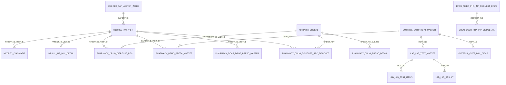

> 类别：关系验证

# ready_his 数据资产二次优化复核报告

## 1. 二次优化说明

本轮不重新无目标扫描全库，而是基于 `31/32/33` 探查结果、`系统表结构/HIS系统数据库表结构.md`、`系统表结构/HIS系统药房药库表设计文档.md`、READY_HIS 活库元数据、核心表只读统计和关系抽样验证，对 HIS 数据资产包做二次清洗。

确定内容：表清洗初筛、核心表候选、A/B/C/D 关系分级、36 张核心表活跃度统计、52 组候选主键样本验证、文档/活库差异清单、后续质量字段计划。

不确定内容：表中文业务含义未在旧文档中逐章精确定位的，均标为需要人工确认；周边 EMR/LIS/PACS/护理/手麻完整关系不纳入本轮 A 级 ER 图。

## 2. 清洗结果

二次优化包目录：`数据资产_HIS_READY二次优化包/`

| 项目 | 数量 | 文件 |
|---|---:|---|
| 全量表决策 | 1234 | `secondary_all_tables_decision.csv` |
| 保留/建议进入资产核心表 | 477 | `secondary_core_tables.csv` |
| 建议排除表 | 179 | `secondary_excluded_tables.csv` |
| 待人工确认表 | 578 | `secondary_manual_confirm_tables.csv` |
| 时间字段候选 | 1810 | `secondary_time_field_candidates.csv` |
| 后续质量字段任务 | 3556 | `secondary_quality_field_plan.csv` |

排除表仅限日志、临时、备份、测试、错误、同步队列等技术表或既有明确排除口径。药品目录、供应商目录、医保目录等业务参考表不直接排除，已放入待人工确认。

## 3. 活跃度分析

本轮对 36 张核心/高价值表执行只读统计。结果：

| 活跃度 | 数量 | 说明 |
|---|---:|---|
| 活跃表 | 22 | 近 5 天或 30 天仍有数据 |
| 历史表 | 2 | `PHARMACY.DRUG_DISPENSE_REC*` 最近数据到 2025-07-04，保留历史查询价值 |
| 无法判断 | 12 | 字典表或未选定可靠业务时间字段 |

明细见 `secondary_activity_stats.csv`。其中 `LAB.LAB_RESULT` 为超大表，未做全表时间扫描，后续必须按 `TEST_NO` 或分区口径限定。

## 4. 业务域归类与主键分析

已按患者主索引、门诊就诊、住院就诊、诊断、医嘱、处方、药品、检查、检验、费用收费、科室字典、人员字典、项目字典、药品字典等业务域归类。每张表均输出业务域、表类型、数据粒度、候选主键、候选关联字段、是否纳入治理。

候选主键样本验证共 52 组：

| 结果 | 数量 | 说明 |
|---|---:|---|
| 样本可作为主键 | 20 | 前 100000 行样本唯一且无空 |
| 样本不可作为主键 | 29 | 有重复或空值 |
| 待确认 | 3 | 字段不存在或查询需后续复核 |

关键纠偏：`PATIENT_ID` 只能作为患者关联键，不能作为门诊/住院事实主键；`PHARMACY.DRUG_DISPENSE_REC` 的四字段医嘱键可作关联键，但不是明细主键；`DOCT_DRUG_PRESC_MASTER(PRESC_DATE+PRESC_NO)` 样本可唯一，当前住院待发药处方链路更活跃。

## 5. 关系校正

关系分级输出：

| 级别 | 数量 | 文件 | 处理 |
|---|---:|---|---|
| A | 16 | `secondary_relationships_A.csv` | 可进入正式数据资产模型和 Mermaid ER 图 |
| B | 16 | `secondary_relationships_B.csv` | 进入人工复核，不进入正式 ER 图 |
| C | 3 | `secondary_relationships_C.csv` | 暂不采用，保留候选池重验 |
| D | 4 | `secondary_relationships_D.csv` | 缺少关键证据，需人工确认 |

本轮已去除重复正式边。B/C/D 关系不进入正式 ER 图。

## 6. 文档与实际库差异

差异清单见 `secondary_doc_actual_differences.csv`，共 6867 条：

| 差异类型 | 数量 |
|---|---:|
| 实际库有但文档没有的字段 | 5853 |
| 文档中有但实际库没有的字段 | 958 |
| 文档中有但实际库没有的表 | 28 |
| 实际库有但文档没有的表 | 28 |

风险：旧文档不能直接作为导入依据；字段备注、来源章节、主键说明必须在治理系统中标记确认状态。

## 7. 后续数据质量分析建议

优先 P1：患者主索引、住院就诊、门诊就诊、诊断、医嘱、检查主表/报告、检验主表/项目/结果、费用收据/明细、当前活跃处方和发药表。

重点规则：主键唯一性、患者/就诊标识空值率、外键孤儿率、时间范围异常、状态值域分布、诊断/项目/药品编码能否关联字典、人员/科室编码有效性。

任务清单已输出到 `secondary_quality_field_plan.csv`。

## 8. 数据治理系统导入建议

建议导入结构字段：

`系统名称、库名、Schema、表名、表中文名、业务域、表类型、数据粒度、主键、关联字段、活跃度、数据量、最近数据时间、是否核心表、是否纳入治理、确认状态、备注、来源文件名称、来源文件章节、文档与实际库是否一致、需要人工确认的问题`。

导入策略：

1. `secondary_core_tables.csv` 作为主资产导入候选。
2. `secondary_excluded_tables.csv` 不进正式资产，仅保留审计清单。
3. `secondary_manual_confirm_tables.csv` 进入人工确认池。
4. `secondary_relationships_A.csv` 进入正式关系图谱。
5. `secondary_relationships_B/C/D.csv` 进入关系复核任务池。
6. `secondary_doc_actual_differences.csv` 进入文档差异治理任务。

## 9. Mermaid ER 图

仅包含 A 级确定关系：

## 10. 待人工确认重点

- 578 张待确认表是否仍在业务流程或数据治理口径中使用。
- 业务目录/供应商/医保目录类表是否纳入治理。
- B 级 16 条少量孤儿关系是否允许以历史数据口径入图。
- C 级 3 条低匹配关系是否存在状态、历史分表或清洗后口径。
- HIS 周边 EMR/LIS/PACS/护理/手麻关系需要按各系统活库单独验证后再入图。

